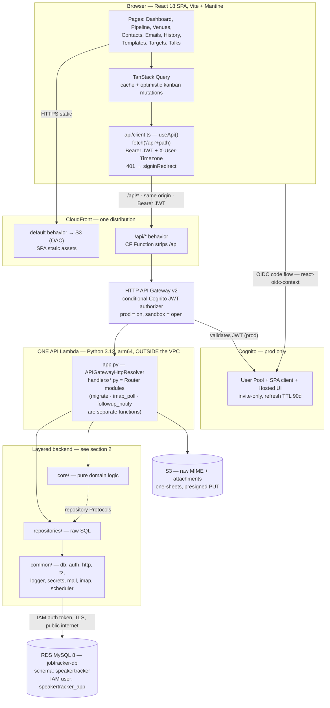
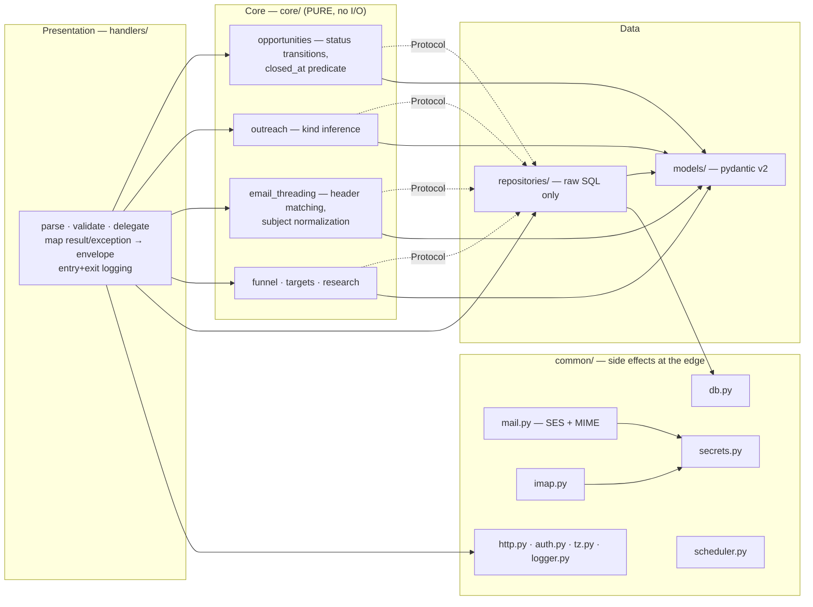
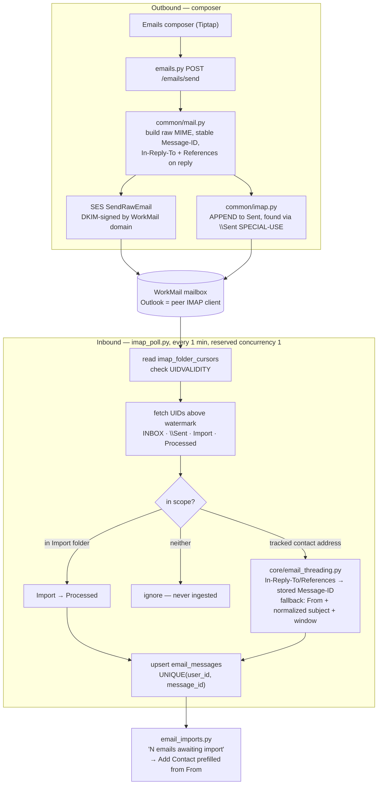
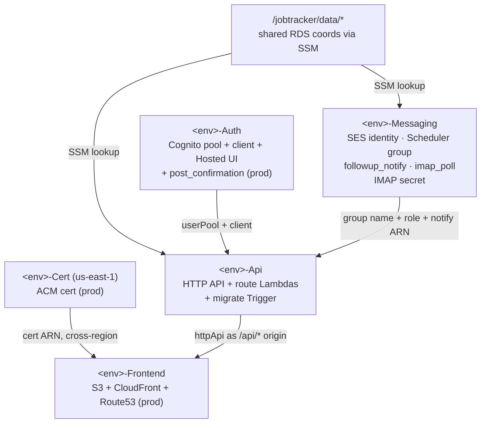

# Speaker Tracker — Component Architecture

Authoritative map of how the pieces fit: the React SPA, one CloudFront distribution serving both
SPA and API, the Python Lambda handlers, the layered backend, the WorkMail/SES/IMAP email
subsystem, and the CDK stacks that deploy them.

> **Status: pre-implementation.** Nothing here is built yet — this is the *target* architecture and
> the contract the scaffold must satisfy. Derived from `DESIGN.md` §3 and
> `CODING-GUIDELINES.md` §1. Where this doc and a sibling repo disagree, the disagreement is
> deliberate and called out inline.

---

## 1. Runtime request flow

The SPA and the API are **same-origin** — one CloudFront distribution, so there is no CORS and no
environment-specific API URL baked into the frontend build.



**Key path facts**

- **Same-origin, no CORS.** The browser calls `/api/...`; a CloudFront Function strips the `/api`
  prefix before the HTTP API sees it.
- **Lambdas run outside any VPC** and reach RDS over the public internet with a short-lived **RDS
  IAM auth token** regenerated per invocation. No password in transit, no ENI cold-start penalty;
  the accepted cost is a 2–6s TLS handshake on a cold start.
- **One Lambda serves every API route**, via Powertools' `APIGatewayHttpResolver` with a `Router`
  per route-group. ~20 separate functions would each cold-start independently and each pay the
  2–6s RDS TLS handshake; a sporadic single user would hit that on nearly every distinct action.
  The layering is unchanged — `handlers/` modules become routers. Background work
  (`migrate`, `imap_poll`, `followup_notify`) stays in its own functions: different triggers,
  schedules, concurrency, and IAM.
- **The DB connection is reused at module scope**, which is only possible *because* of the single
  Lambda. The per-request `SET time_zone` doubles as the liveness probe; on a lost-connection error
  the code reconnects **once** with a fresh IAM token. `ping(reconnect=True)` is **banned** — it
  reuses the expired token stored on the connection. See `CODING-GUIDELINES.md` §2.
- Every data handler calls `apply_session_timezone(conn, event)` immediately after connecting, so
  `CURDATE()` and friends evaluate in the caller's local time. **Kauaʻi is UTC-10**, so "today"
  rollover is ten hours off UTC and every date-bucketed metric depends on this.
- Auth is a Cognito JWT authorizer at the gateway in prod. In **sandbox** the authorizer is omitted
  and `AUTH_MODE=dev` injects a fixed user.

### 1.1 Three fixes we are *not* inheriting

legacy-tracker's equivalents of these are broken; porting them verbatim would import the bugs.

| Problem there | What this app does |
|---|---|
| Unhandled exceptions are re-raised, so API Gateway emits `{"message": "Internal Server Error"}` — a **different error shape** from every handled error | A catch-all in `common/http.py` maps unhandled exceptions to `{"error": "internal error"}` + 500, after `logger.exception`. One error shape, always. |
| `UserNotFoundError` subclasses `LookupError`, falls into the re-raise branch, and surfaces as **500 instead of 404** | Domain exceptions map explicitly; `NotFound → 404` including the user lookup. |
| API client never inspects response status — an **expired token returns a raw `Response`** to callers, which renders as a broken page | `useApi()` treats 401 as an auth event and triggers `signinRedirect()`, preserving the intended path. |

### 1.2 Auth UX and session

No full-screen "Login with Cognito" splash. The app **lands on the normal shell** — nav rail, logo,
header — with a **Sign In** link in the header and a sign-in prompt in the content area. A deep link
followed while signed out is stored and restored after the redirect returns.

Session: `refreshTokenValidity` **90 days**, `automaticSilentRenew` rolling the ≤24h access token
over via the **refresh-token grant** (no hidden iframe), tokens in `localStorage` so a browser
restart stays signed in. Donna signs in roughly quarterly. Accepted because she works from a fixed
office desktop — revisit for multi-user or mobile.

Cognito is **invite-only**: `selfSignUpEnabled: false`, admin-created users, `removalPolicy: RETAIN`.
legacy-tracker uses `true` / `DESTROY`; that is not appropriate for a CRM holding a client's contacts
and correspondence.

---

## 2. Backend layering

Three layers, dependencies pointing **inward only** (`CODING-GUIDELINES.md` §1). The handler is the
**composition root**: it constructs concrete repositories and injects them into core, which depends
only on `Protocol`s it defines. That is what keeps `core/` unit-testable with no database.



**The rule that matters:** `core/` imports no `boto3`, no SQL, no HTTP shapes, no clock, no env.
Anything that reads the world is passed in. Concretely — `core/email_threading.py` receives parsed
headers plus candidate rows and *returns a decision*; `common/imap.py` does the talking.

```
backend/src/
  app.py          resolver + include_router + exception handlers (HTTP composition root)
  api_handler.py  lambda_handler for the one API function
  handlers/       presentation — one Router module per route-group
  core/           business logic — pure (purity enforced by ruff, see §8)
  repositories/   data access — raw SQL, one module per aggregate
  models/         pydantic models — API contracts + typed rows
  migrations/     runner.py + forward-only .sql
  common/         shared infra
```

**Response envelope** matches the siblings: bare JSON on success (each handler names its own
top-level keys — no `{"data": ...}` wrapper), `{"error": "<message>"}` on failure, with
400 / 404 / 500 mapped centrally.

**Exception handlers register on `app`, never on a `Router`** — router-level propagation through
`include_router` has been version-dependent, and centralizing them is what guarantees the single
error shape §1.1 promises. A **single `@app.exception_handler(Exception)` catch-all** delegates to
`common/http.py`'s `response_for_exception`, whose ordered `isinstance` map decides the status — and
which honours Powertools' own `ServiceError.status_code`, so an unmatched route returns 404 rather
than a false 500. This removes any dependence on Powertools' exception-handler MRO precedence: the
mapping is deterministic Python we own and unit-test.

**Entry/exit logging wraps `app.resolve` in `api_handler.lambda_handler`, not a middleware.**
Powertools runs exception handlers *outside* the global middleware chain, so a middleware never
observes the mapped error status (or unmatched routes at all); `app.resolve` returns the final
response dict for every outcome, so wrapping it logs the true status, at a level that mirrors it
(5xx → ERROR, 4xx → WARNING, else INFO).
`@logger.inject_lambda_context(correlation_id_path=correlation_paths.API_GATEWAY_HTTP)` supplies the
correlation id. Never set `log_event=True` — it logs the raw event, which carries the JWT.

---

## 3. Endpoint → router map

Every row below except the three marked *(separate function)* is a **`Router` module inside the one
API Lambda**, registered in `app.py` via `include_router`. The `ROUTES` table in
`infra/cdk/lib/api-stack.ts` therefore maps **route → authorizer**, not route → function: it
declares each path/method on the HTTP API and decides whether the JWT authorizer applies.

**Routes are declared explicitly, not as `ANY /{proxy+}`.** Two reasons: `/health` can stay
unauthenticated for uptime checks while everything else carries the authorizer, and the gateway
rejects unknown paths itself — so a 405 never has to be synthesized from Powertools' private route
table.

| Router module | Routes |
|---|---|
| `health.py` | GET `/health` — **no authorizer** |
| `migrate.py` | *(separate function — in-deploy `Trigger`)* |
| `post_confirmation.py` | *(separate function — Cognito trigger; prod only, in the Auth stack)* |
| `catalogs.py` | GET `/catalogs` |
| `organizations.py` | GET/POST `/organizations`, GET/PUT/DELETE `/organizations/{id}` |
| `contacts.py` | GET/POST `/contacts`, GET/PUT/DELETE `/contacts/{id}`, GET `/contacts/{id}/timeline` |
| `contact_organizations.py` | POST `/contacts/{id}/organizations`, PUT/DELETE `/contacts/{id}/organizations/{orgId}` |
| `opportunities.py` | GET/POST `/opportunities`, GET/PUT/DELETE `/opportunities/{id}`, PATCH `/opportunities/{id}/status`, POST `/opportunities/{id}/close` |
| `opportunity_contacts.py` | POST `/opportunities/{id}/contacts`, PUT/DELETE `/opportunities/{id}/contacts/{contactId}` |
| `opportunity_notes.py` | GET/POST `/opportunities/{id}/notes`, PUT/DELETE `/opportunities/{id}/notes/{noteId}` |
| `outreaches.py` | GET/POST `/outreaches`, GET/PUT/DELETE `/outreaches/{id}` |
| `message_templates.py` | GET/POST `/message-templates`, PUT/DELETE `/message-templates/{id}`, POST `/message-templates/{id}/duplicate` |
| `follow_ups.py` | GET/POST `/follow-ups`, PUT/DELETE `/follow-ups/{id}`, POST `/follow-ups/{id}/complete` |
| `targets.py` | GET/PUT `/targets` |
| `dashboard.py` | GET `/dashboard` |
| `emails.py` | GET `/emails/threads`, GET `/emails/threads/{id}`, PATCH `/emails/threads/{id}` (read / close), POST `/emails/send`, POST `/emails/threads/{id}/reply` |
| `email_imports.py` | GET `/emails/pending-import`, POST `/emails/pending-import/{id}/link` |
| `talks.py` | GET/POST `/talks`, PUT/DELETE `/talks/{id}` |
| `materials.py` | GET/POST `/materials`, POST `/materials/presign`, DELETE `/materials/{id}` |
| `imap_poll.py` | *(separate function — EventBridge, 1-minute)* |
| `followup_notify.py` | *(separate function — EventBridge Scheduler target)* |
| `seed_sandbox_user.py` | *(no route — sandbox seeding)* |

**History has no handler of its own.** It is closed opportunities:
`GET /opportunities?closed=true` for the table, `GET /opportunities/{id}` for the detail. Adding a
parallel `history.py` would duplicate the same SQL against the same rows.

**Dedupe is a query, not an endpoint.** The add-contact "this person may already exist" step is
`GET /contacts?q=` against the existing list route — no separate search handler.

---

## 4. Email subsystem

The most involved part of the app, and the one that least resembles either sibling — job-tracker's
Gmail OAuth cluster is **not reusable**.

**The mailbox is in a different AWS account from the app, and this costs nothing.**

| Piece | Account | Region |
|---|---|---|
| App — Lambdas, RDS, S3, Cognito, CloudFront | **381492047863** (Brian) | us-west-2 |
| SES sending identity `360balancedliving.com` | **381492047863** | **us-east-1** |
| WorkMail mailbox `m-aa419e28e9c44881a91c711910d9b1b5` | **730335513412** (Donna) | us-east-1 |

**No cross-account IAM, no `sts:AssumeRole`, no SES sending-authorization policy.** Two independent
reasons:

- **Sending** uses the `360balancedliving.com` domain identity **already verified in Brian's
  account** (DKIM `SUCCESS`). Domain verification covers every address beneath it, so
  `From: donna@…` needs neither a per-address identity nor a role in Donna's account. The SES client
  is simply constructed with `region_name="us-east-1"` while the Lambda runs in us-west-2 — a client
  argument, not an architectural seam.
- **IMAP is username/password**, not IAM. Reaching her WorkMail mailbox is a credential concern, not
  an account-boundary concern. Endpoint is us-east-1.

> **SES production access: granted** (us-east-1, 2026-07-18) — **50,000/day, 14 msg/s**,
> enforcement `HEALTHY`. Slice 6a is unblocked. Note production access is **per-region**; this grant
> covers us-east-1 only, which is the region the identity and the WorkMail mailbox both live in.
> Real volume here is a handful of messages a day, so the quota is irrelevant — what mattered was
> escaping the sandbox's verified-recipients-only restriction.



**Scope — two consented surfaces, never the whole mailbox.** (a) correspondence with a tracked
contact, matched against the `(user_id, email)` index on `contacts`, or against a stored outbound
`Message-ID`; (b) messages Donna explicitly dragged into `Speaker Tracker/Import`. Everything else
is ignored at the poller, not filtered later in the UI.

**Folders are auto-created, never typed.** On first connect and defensively on every poll, the
poller `LIST`s and, if missing, `CREATE`s **and `SUBSCRIBE`s** `Speaker Tracker/Import` and
`Speaker Tracker/Processed`. `SUBSCRIBE` matters — an unsubscribed folder may not appear in
Outlook's tree, which is indistinguishable from the folder never being created. `\Sent` is
*discovered* via SPECIAL-USE, never assumed by name: it is WorkMail's folder, not ours.

**Why a folder move rather than forward-to-import:** an IMAP move transfers the original RFC822
message byte-for-byte, so the `Message-ID` survives and Donna's reply threads correctly at the
venue's end. Forwarding rewrites the `Message-ID`, forcing `.eml`-attachment parsing and
mis-threading the reply.

**Non-negotiables for a 1-minute interval** (retrofitting the cursor means a backfill):

- **Reserved concurrency = 1** — a poll running past 60s must never overlap the next.
- **Per-folder `UIDNEXT` cursor**, with `UIDVALIDITY` checked and the cursor **reset** if it
  changed. Stale UIDs across a UIDVALIDITY change either re-import everything or skip mail forever.
- **Secrets Manager fetch cached at module scope** — not once per minute.
- **`LOGOUT` in a `finally`** on every path. WorkMail caps simultaneous IMAP connections per
  mailbox and Outlook already holds some; leaked connections exhaust the quota.
  *Verify that quota before deploying.*

**The IMAP secret: CDK owns the resource, never the value.** The `Secret` construct carries tags,
`removalPolicy: RETAIN`, and `grantRead` to the poller; the password is written once with
`aws secretsmanager put-secret-value`. Reading a gitignored config at synth time would require
`SecretValue.unsafePlainText()`, which embeds the password in the synthesized template — landing it
in `cdk.out/`, the CDK staging bucket, and CloudFormation. Mailbox is
`donna.king@360balancedliving.com` at `imap.mail.us-east-1.awsapps.com:993`; no MFA, so plain
username/password authenticates.

**IMAP auth failure must alarm.** A wrong or rotated password produces a *silent* failure mode: the
poller runs on schedule, authenticates nothing, finds nothing, and inbound threading stops with no
error surface. Treat auth errors as an alarm, distinct from the transient network errors the poller
retries.

**Write invariant:** a send writes `email_messages` + `email_threads` + `outreaches` (+ optionally
`follow_ups`) in **one transaction**. A partial write loses the touch or orphans the thread.

**Threading uses RFC 5322 headers only** — `Message-ID` / `In-Reply-To` / `References`. Microsoft's
proprietary `Thread-Index` is not used; external senders don't set it.

---

## 5. Scheduled work

| Trigger | Target | Purpose |
|---|---|---|
| EventBridge **Rule**, `rate(1 minute)` | `imap_poll.py` | Reply threading + drop-folder imports |
| EventBridge **Scheduler**, one-shot `at()` | `followup_notify.py` | Due follow-up reminder via SES |

Follow-up scheduling is ported from job-tracker: deterministic schedule name **`followup-<id>`**, so
create/update/delete need no state read-back; `NotFound` on cancel is swallowed because a one-shot
schedule may already have fired. `common/scheduler.py` **no-ops with a warning** when its env vars
are unset, which lets the Api stack function before the Messaging stack exists.

`followup_notify.py` **never touches the database** — every field needed to render the email travels
in the schedule payload. That keeps it outside the VPC with no SES interface endpoint. The accepted
tradeoff: payloads are snapshots, so editing a follow-up after scheduling requires
cancel-then-recreate (which the handler does).

---

## 6. Infrastructure — CDK stacks

One TypeScript CDK app, parameterized per environment by `authMode`. Stacks wire by **direct
construct reference** — no SSM plumbing between our own stacks. The shared RDS instance is
*referenced* from `/jobtracker/data/*`, never constructed here.



Acyclic by construction: no SPA↔API URL cycle (same-origin), no auth↔api cycle (`post_confirmation`
lives in `Auth`), and `Messaging` depends on nothing of `Api`'s — `imap_poll` writes to the database
directly and `followup_notify` reads only its payload.

| Stack | Region | Role | Envs |
|---|---|---|---|
| `<env>-Auth` | us-west-2 | Cognito pool, client, Hosted UI, post-confirmation trigger | prod |
| `<env>-Cert` | **us-east-1** | ACM cert for the SPA domain | prod |
| `<env>-Messaging` | us-west-2 | Scheduler group + exec role, `followup_notify`, `imap_poll` + its 1-min rule, IMAP secret. **SES clients target us-east-1**; the identity is pre-existing and *referenced*, never created | prod + sandbox |
| `<env>-Api` | us-west-2 | HTTP API, route Lambdas, migrate Trigger, conditional JWT authorizer | prod + sandbox |
| `<env>-Frontend` | us-west-2 | S3 SPA bucket, CloudFront (S3 + `/api/*` origins), Route53 alias | prod + sandbox |

**DNS and certificate — all in account 381492047863:**

| Fact | Value |
|---|---|
| Hostname | **`speaker-tracker.360balancedliving.com`** |
| Hosted zone | `Z08490251WV9146J97IRG` (`360balancedliving.com`) |
| Record status | **Does not exist yet** — created by the Frontend stack |
| Cert | New ACM cert in **us-east-1**, DNS-validated (CloudFront requires us-east-1) |

The zone is same-account, so DNS validation and the Route53 alias need no cross-account delegation.
Sibling subdomains already in the zone (`legacy.`, `portal.`, `admin.`, `podcasts.`) confirm the
pattern.

> **The SES identity is *not* a CDK-owned resource.** `360balancedliving.com` was verified out of
> band and is shared with other senders on this domain; a CDK `EmailIdentity` construct would try to
> own it, and a stack teardown could delete a verification that other systems depend on. Reference
> it by ARN, exactly as `shared-db.ts` references the RDS instance.

**Sandbox deploys no Cert, Auth, or Route53 stack** — it serves from the default
`*.cloudfront.net` domain behind an **open gateway** with `ENV_TYPE=sandbox` / `AUTH_MODE=dev`.
That halves the sandbox surface and avoids a second ACM validation.

### 6.1 Three CDK details that are easy to get wrong

**🚫 Do not use `Distribution.errorResponses` for the SPA fallback.** It is **distribution-wide, not
per-behavior**, so the usual `403 → /index.html (200)` mapping also rewrites genuine 401/403 from the
Cognito authorizer and 404s from `@app.not_found` into an HTML page with status 200. `useApi()`'s
401 handling would then never fire — reintroducing precisely the bug class §1.1 says we are not
inheriting. Instead attach a **second CloudFront Function to the default behavior only**, rewriting
extension-less paths to `/index.html`. `/api/*` stays untouched.

**Host header.** `/api/*` uses the managed `OriginRequestPolicy.ALL_VIEWER_EXCEPT_HOST_HEADER` — it
forwards `Authorization` and `X-User-Timezone` while suppressing `Host`, so API Gateway sees its own
execute-api hostname and routes correctly. Pair with `CACHING_DISABLED`; CloudFront refuses to
forward `Authorization` in an origin request policy when caching is enabled.

**Zone lookup.** Use `HostedZone.fromHostedZoneAttributes` (id `Z08490251WV9146J97IRG`), **not
`fromLookup`** — no context cache means `cdk synth` needs no AWS credentials, which is what lets the
infra CI job run. The first `fromLookup` added anywhere breaks that job.

**Cognito uses Managed Login**, not the classic Hosted UI, which is in maintenance and supports
neither passkeys nor real branding. Managed Login requires the **Essentials** feature plan and an
explicit branding resource — with `NEWER_MANAGED_LOGIN` and no branding configured the sign-in page
can render unstyled. There is no L2 construct; use `CfnManagedLoginBranding` with
`useCognitoProvidedValues: true`.

**Send the ID token, not the access token.** `HttpJwtAuthorizer` validates `aud`; Cognito ID tokens
carry `aud = clientId` while access tokens carry `client_id` and no `aud`. Whether API Gateway
special-cases the latter is unverified — ship with the ID token and test the alternative
empirically. The failure mode is a blanket 401 with nothing in the Lambda logs.

### 6.2 Function sizing

| Function | Memory | Timeout | Reserved concurrency |
|---|---|---|---|
| API | 1024 MB | 15s | 5 |
| `migrate` | 512 MB | 300s | 1 |
| `post_confirmation` | 512 MB | **5s** (Cognito's hard cap) | 2 |

1024 MB on arm64 is the sweet spot — CPU scales with memory, so Python + pydantic import is roughly
twice as fast as at 512 MB for near-identical cost, since duration halves. Reserved concurrency 5
bounds connections against the shared `db.t4g.micro`, and a 15s timeout stays under API Gateway's
30s integration cap so you see your own timeout rather than the gateway's. **No provisioned
concurrency** — roughly $5/month per unit to save 2–6s for one user who signs in quarterly.

Port `common/auth.py`'s import-time assertion **verbatim**:

```python
if _AUTH_MODE == "dev" and _ENV_TYPE != "sandbox":
    raise RuntimeError("AUTH_MODE=dev is only allowed when ENV_TYPE=sandbox")
```

A misconfigured prod Lambda then fails at cold start rather than silently accepting anonymous
traffic against Donna's CRM.

**Observability — Powertools Logger + Metrics on, Tracer off by default.** Structured JSON logging
(§2) is always on. **Metrics** (CloudWatch EMF) are active on the API handler with
`capture_cold_start_metric=True`: EMF emits metrics as log lines, so there is **no added latency and
no `PutMetricData` call**, and the app's known cold-start cost becomes measurable for free
(namespace `SpeakerTracker`). **Tracer** (X-Ray) is wired on the handler but **disabled by default**
via `POWERTOOLS_TRACE_DISABLED=true` (set per-env in CDK) — the `aws-xray-sdk` import adds cold-start
weight the quarterly-sign-in user shouldn't pay to trace one request; flip it on per-env when
investigating (it earns its keep on the SES/IMAP subsegments in slice 6). Metrics needs no extra
dependency; the Tracer is pulled in by the `aws-lambda-powertools[tracer]` extra.

**Config vs secrets.** Everything except the IMAP credential is an env var resolved from SSM at
*deploy* time — matching both siblings, which perform no runtime parameter reads. The WorkMail IMAP
credential is the **first runtime secret** in the family: `common/secrets.py`, module-scope cached,
used only by `imap_poll`. Sending needs no credential at all — SES is IAM-authed.

---

## 7. Frontend structure

```
frontend/src/
  pages/        one per route
  components/   shared UI — AppShell, PipelineBoard, ThreadView, composer
  api/          client.ts (useApi) + one hook module per resource
  auth/         config.ts, devAuth.tsx
```

| Path | Page |
|---|---|
| `/` | Dashboard — targets vs actuals, funnel, money rollup, Needs attention |
| `/pipeline` | Kanban board (dnd-kit), full browser width |
| `/venues`, `/venues/{id}` | Organizations list + detail with the Kindling research panel |
| `/contacts`, `/contacts/{id}` | Contacts list + detail with multi-org affiliations and timeline |
| `/opportunities/{id}` | Opportunity detail — fields, linked contacts, dated notes, lifecycle |
| `/emails`, `/emails/{threadId}` | Thread list + thread view with inline reply |
| `/history`, `/history/{id}` | Closed gigs table + detail |
| `/templates`, `/targets`, `/talks` | Templates, Targets, Talks & materials |

**TanStack Query** owns server state — this is the piece both siblings lack, and the optimistic
kanban drag (move card → `PATCH /opportunities/{id}/status` → rollback on failure) is why it is
non-optional here.

**Server-owned ordering.** Stage order, labels, and funnel composition come from `/catalogs` and the
dashboard response. The frontend never re-derives `sort_order` or hardcodes stage names — same
discipline as legacy-tracker's `common/funnel.py`.

Light theme by default (Donna dislikes dark themes); **sans-serif** — the brand guide's Playfair /
Lato pairing is for the public website, not this internal tool. Color carries the brand: navy
`#1F3B4D` nav rail and headings, terracotta `#C2483A` primary actions, gold `#D9A02C` accents and
power-partner ★, cream `#FBF8F2` page background.

---

## 8. Testing & CI

`pytest`, mirroring the source tree under `backend/tests/unit/`. `core/` is pure, so it tests with
no database and no mocking — that is the entire point of the layering. Repository tests exercise
real SQL against a test schema with transaction rollback; handler tests cover validation, the happy
path, and error mapping.

**`core/` purity is enforced by ruff, not by review.** A `backend/src/core/.ruff.toml` inherits the
root config and adds `flake8-tidy-imports.banned-api` entries for `boto3`, `pymysql`,
`aws_lambda_powertools.event_handler`, and `os.environ`. Ruff's hierarchical config turns a layering
violation into a CI failure instead of a code-review argument. The root config also bans
`pymysql.connections.Connection.ping` (§1).

**The test schema is built by running the real migration runner** against an empty database, not by
a hand-maintained fixture. Two payoffs: the test schema cannot drift from production, and the
riskiest new code in slice 1 gets exercised on every push for free. This imposes one design
constraint worth honouring from the start — `runner.run()` must take a connection and a directory as
**parameters**, never read env vars at import.

CI runs DB-backed tests against a **`mysql:8.4`** service container, pinned to match RDS 8.4.8:
`mysql:8.0` differs on `utf8mb4` collation defaults, which is exactly the drift that makes CI green
and production red. Those tests **skip** when `TEST_DATABASE_URL` is unset, so `pytest` still runs on
a machine without Docker — otherwise developers quietly stop running tests locally.

**GitHub Actions from slice 1** — `ruff`, `pytest`, `tsc --noEmit` on PR and push. **No deploy
step**; deploys stay manual.

> Neither sibling has any CI, and legacy-tracker carries **2 tests total** despite being scaffolded
> from job-tracker's ~280. `CODING-GUIDELINES.md` §7 is currently aspirational across the family;
> this is where it stops being.

Highest-value tests, in order: the `closed_at` predicate (§4 of `DATABASE.md`), outreach-kind
inference, `email_threading` header matching including the broken-`References` fallback, and the
UIDVALIDITY reset path.