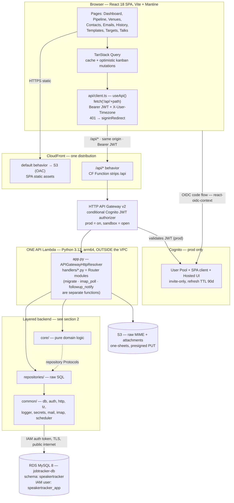
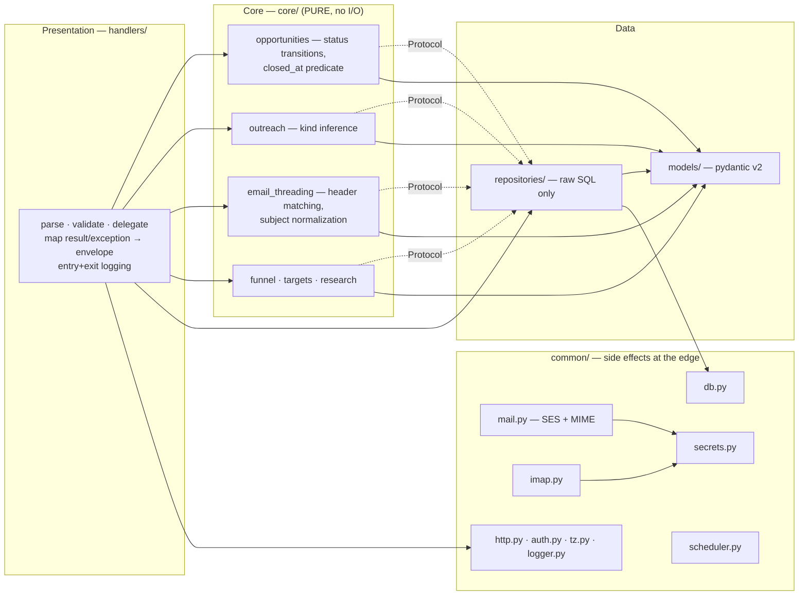
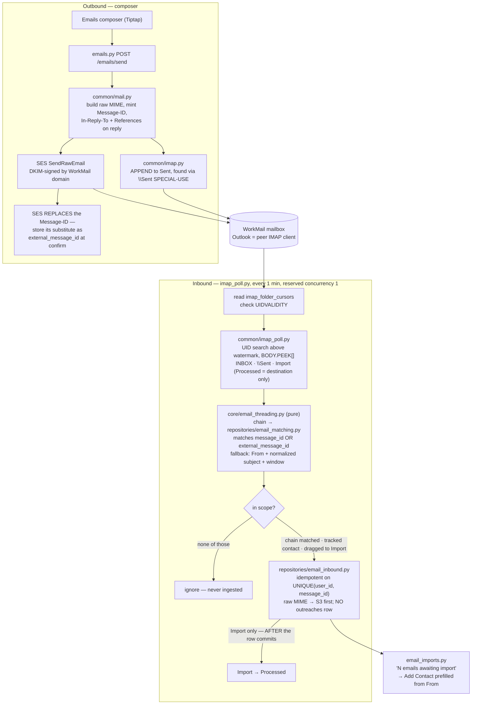
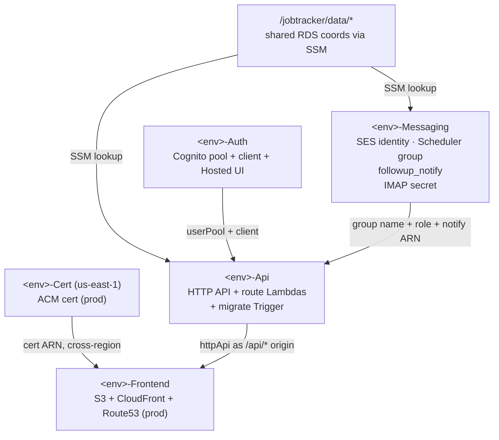

# Speaker Tracker — Component Architecture

Authoritative map of how the pieces fit: the React SPA, one CloudFront distribution serving both
SPA and API, the Python Lambda handlers, the layered backend, the WorkMail/SES/IMAP email
subsystem, and the CDK stacks that deploy them.

> **Status: fully implemented and live in production** (slices 1–12). The request path, layers, CDK
> stacks and every endpoint row below are built and deployed to both environments. Derived from
> `DESIGN.md` §3 and `CODING-GUIDELINES.md` §1. Where this doc and a sibling repo disagree, the
> disagreement is deliberate and called out inline.

---

## 1. Runtime request flow

The SPA and the API are **same-origin** — one CloudFront distribution, so there is no CORS and no
environment-specific API URL baked into the frontend build.


```mermaid
flowchart TB
    subgraph Browser["Browser — React 18 SPA, Vite + Mantine"]
        UI["Pages: Dashboard, Pipeline, Venues,<br/>Contacts, Emails, History,<br/>Templates, Targets, Talks"]
        RQ["TanStack Query<br/>cache + optimistic kanban mutations"]
        APICLIENT["api/client.ts — useApi()<br/>fetch('/api'+path)<br/>Bearer JWT + X-User-Timezone<br/>401 → signinRedirect"]
        UI --> RQ --> APICLIENT
    end

    subgraph Auth["Cognito — prod only"]
        COG["User Pool + SPA client + Hosted UI<br/>invite-only, refresh TTL 90d"]
    end

    subgraph CFDIST["CloudFront — one distribution"]
        S3SPA["default behavior → S3 (OAC)<br/>SPA static assets"]
        APIB["/api/* behavior<br/>CF Function strips /api"]
    end

    APIGW["HTTP API Gateway v2<br/>conditional Cognito JWT authorizer<br/>prod = on, sandbox = open"]

    subgraph Lambdas["ONE API Lambda — Python 3.12, arm64, OUTSIDE the VPC"]
        LH["app.py — APIGatewayHttpResolver<br/>handlers/*.py = Router modules<br/>(migrate · imap_poll · followup_notify<br/>are separate functions)"]
    end

    subgraph Backend["Layered backend — see section 2"]
        CORE["core/ — pure domain logic"]
        REPO["repositories/ — raw SQL"]
        COMMON["common/ — db, auth, http, tz,<br/>logger, secrets, mail, imap, scheduler"]
    end

    RDS[("RDS MySQL 8 — jobtracker-db<br/>schema: speakertracker<br/>IAM user: speakertracker_app")]
    S3ATT[("S3 — raw MIME + attachments<br/>one-sheets, presigned PUT")]

    UI -->|"HTTPS static"| S3SPA
    Browser -->|"OIDC code flow — react-oidc-context"| COG
    APICLIENT -->|"/api/* · same origin · Bearer JWT"| APIB
    APIB --> APIGW
    APIGW -->|"validates JWT (prod)"| COG
    APIGW --> LH
    LH --> CORE
    LH --> REPO
    CORE -.->|"repository Protocols"| REPO
    REPO --> COMMON
    COMMON -->|"IAM auth token, TLS, public internet"| RDS
    LH --> S3ATT
```

**Key path facts**

- **Same-origin, no CORS.** The browser calls `/api/...`; a CloudFront Function strips the `/api`
  prefix before the HTTP API sees it.
- **Lambdas run outside any VPC** and reach RDS over the public internet with a short-lived **RDS
  IAM auth token** regenerated per invocation. No password in transit, no ENI cold-start penalty;
  the accepted cost is a 2–6s TLS handshake on a cold start.
- **One Lambda serves every API route**, via Powertools' `APIGatewayHttpResolver` with a `Router`
  per route-group. ~20 separate functions would each cold-start independently and each pay the
  2–6s RDS TLS handshake; a sporadic single user would hit that on nearly every distinct action.
  The layering is unchanged — `handlers/` modules become routers. Background work
  (`migrate`, `imap_poll`, `followup_notify`) stays in its own functions: different triggers,
  schedules, concurrency, and IAM.
- **The DB connection is reused at module scope**, which is only possible *because* of the single
  Lambda. The per-request `SET time_zone` doubles as the liveness probe; on a lost-connection error
  the code reconnects **once** with a fresh IAM token. `ping(reconnect=True)` is **banned** — it
  reuses the expired token stored on the connection. See `CODING-GUIDELINES.md` §2.
- Every data handler calls `apply_session_timezone(conn, event)` immediately after connecting, so
  `CURDATE()` and friends evaluate in the caller's local time. **Kauaʻi is UTC-10**, so "today"
  rollover is ten hours off UTC and every date-bucketed metric depends on this.
- Auth is a Cognito JWT authorizer **at the gateway** in prod — see §1.1, which exists because this
  one line is easy to misread. In **sandbox** the authorizer is omitted and `AUTH_MODE=dev` injects
  a fixed user.

### 1.1 Where authentication actually happens

**The authorizer is on the gateway. `common/auth.py` is not an authorizer**, despite the name — and
that distinction is worth stating because the file reads like one.

`api-stack.ts` builds an `HttpJwtAuthorizer` (Cognito issuer + app-client audience) and attaches it
**per route** from the `ROUTES` table's `authRequired` flag. API Gateway validates the JWT *before*
invoking anything: an unauthenticated request to a protected route is rejected with a 401 by the
gateway and **never reaches the function**. Nothing in the Lambda is load-bearing for keeping
strangers out.

What `common/auth.py::principal_from_event` does is read claims the gateway has *already verified*:

```python
claims = event["requestContext"]["authorizer"]["jwt"]["claims"]
```

That is **identity extraction, not authentication**. Its `Unauthorized` on a missing `sub` is a
misconfiguration guard, not a security boundary — if that fires in prod, an authorizer is missing
from a route, not an attacker got through.

**Sandbox genuinely is open, and that is the deliberate exception.** It deploys no Cognito, so
`props.auth` is undefined, every route falls back to `HttpNoneAuthorizer`, and traffic *does* reach
the Lambda unauthenticated — where the dev principal is injected. So sandbox is a public
`*.cloudfront.net` URL over real data with no authentication at all. Fine while the data is
disposable; **not** fine once it holds Donna's actual contacts.

The guard against that leaking into prod is at **import time**, not per request:

```python
if _AUTH_MODE == "dev" and _ENV_TYPE != "sandbox":
    raise RuntimeError("AUTH_MODE=dev is only allowed when ENV_TYPE=sandbox")
```

A prod Lambda deployed with dev auth **fails its cold start** rather than quietly serving anonymous
traffic, and both env vars default to their production-safe values so a *missing* `ENV_TYPE` trips
it too. `infra/cdk/test/authorizer.test.ts` asserts the route-level wiring.

### 1.2 Three fixes we are *not* inheriting

legacy-tracker's equivalents of these are broken; porting them verbatim would import the bugs.

| Problem there | What this app does |
|---|---|
| Unhandled exceptions are re-raised, so API Gateway emits `{"message": "Internal Server Error"}` — a **different error shape** from every handled error | A catch-all in `common/http.py` maps unhandled exceptions to `{"error": "internal error"}` + 500, after `logger.exception`. One error shape, always. |
| `UserNotFoundError` subclasses `LookupError`, falls into the re-raise branch, and surfaces as **500 instead of 404** | Domain exceptions map explicitly; `NotFound → 404` including the user lookup. |
| API client never inspects response status — an **expired token returns a raw `Response`** to callers, which renders as a broken page | `useApi()` treats 401 as an auth event and triggers `signinRedirect()`, preserving the intended path. |

### 1.3 Auth UX and session

No full-screen "Login with Cognito" splash. The app **lands on the normal shell** — nav rail, logo,
header — with a **Sign In** link in the header and a sign-in prompt in the content area. A deep link
followed while signed out is stored and restored after the redirect returns.

Session: `refreshTokenValidity` **90 days**, `automaticSilentRenew` rolling the ≤24h access token
over via the **refresh-token grant** (no hidden iframe), tokens in `localStorage` so a browser
restart stays signed in. Donna signs in roughly quarterly. Accepted because she works from a fixed
office desktop — revisit for multi-user or mobile.

Cognito is **invite-only**: `selfSignUpEnabled: false`, admin-created users, `removalPolicy: RETAIN`.
legacy-tracker uses `true` / `DESTROY`; that is not appropriate for a CRM holding a client's contacts
and correspondence.

---

## 2. Backend layering

Three layers, dependencies pointing **inward only** (`CODING-GUIDELINES.md` §1). The handler is the
**composition root**: it constructs concrete repositories and injects them into core, which depends
only on `Protocol`s it defines. That is what keeps `core/` unit-testable with no database.


```mermaid
flowchart LR
    subgraph P["Presentation — handlers/"]
        H["parse · validate · delegate<br/>map result/exception → envelope<br/>entry+exit logging"]
    end
    subgraph C["Core — core/ (PURE, no I/O)"]
        C1["opportunities — status transitions,<br/>closed_at predicate"]
        C2["outreach — kind inference"]
        C3["email_threading — header matching,<br/>subject normalization"]
        C4["funnel · targets · research"]
    end
    subgraph D["Data"]
        R["repositories/ — raw SQL only"]
        M["models/ — pydantic v2"]
    end
    subgraph CM["common/ — side effects at the edge"]
        DB["db.py"]
        SEC["secrets.py"]
        MAIL["mail.py — SES + MIME"]
        IMAP["imap.py"]
        SCH["scheduler.py"]
        HTTP["http.py · auth.py · tz.py · logger.py"]
    end

    H --> C1 & C2 & C3 & C4
    H --> R
    C1 & C2 & C3 & C4 -.->|"Protocol"| R
    C1 & C2 & C3 & C4 --> M
    R --> M
    R --> DB
    H --> HTTP
    MAIL --> SEC
    IMAP --> SEC
```

**The rule that matters:** `core/` imports no `boto3`, no SQL, no HTTP shapes, no clock, no env.
Anything that reads the world is passed in. Concretely — `core/email_threading.py` receives parsed
headers plus candidate rows and *returns a decision*; `common/imap.py` does the talking.

```
backend/src/
  app.py          resolver + include_router + exception handlers (HTTP composition root)
  api_handler.py  lambda_handler for the one API function
  handlers/       presentation — one Router module per route-group, plus edge helpers:
                  context.py   (authenticate(): principal→connection→user upsert — auth root)
                  params.py    (path/query-parameter parsing, e.g. path_int → 404)
                  responses.py (detail-response composition, so no route imports a sibling route)
  core/           business logic — pure (purity enforced by ruff, see §8)
                  email_headers.py  subject/Message-ID/address normalization, reply chaining
                  email_threading.py  which thread a message joins (chain, then guarded fallback)
                  email_scope.py    whether a polled message enters the app at all
                  imap_cursor.py    where a poll starts reading; PollSummary
  repositories/   data access — raw SQL, one module per aggregate
                  email_sends.py    outbound: the three-phase intent-first send
                  email_threads.py  thread + message READS, and the gig-close auto-close hook
                  email_matching.py inbound READS that feed the pure matcher
                  email_inbound.py  inbound WRITE — idempotent ingest
                  email_imports.py  the pending-import queue and its two link actions
                  imap_cursors.py   per-folder poll watermarks
  models/         pydantic models — API contracts + typed rows
  migrations/     runner.py + forward-only .sql
  common/         shared infra
                  mail.py       OUTBOUND MIME assembly + the SES edge
                  mail_parse.py INBOUND parsing — headers (poller) and body (thread view)
                  imap.py       connection, auth, folder topology, Sent-folder APPEND
                  imap_poll.py  message-level ops: select, UID search, fetch, move
```

**The email modules split reads from writes on both sides**, which is why there are six of them
rather than two: `email_sends`/`email_threads` for the outbound half (slice 6a) and
`email_matching`/`email_inbound` for the inbound half (6b), with `common/mail` vs `common/mail_parse`
and `common/imap` vs `common/imap_poll` following the same seam. Each pair was split when the
combined file passed the size guideline, and the seam was chosen to match the existing precedent
rather than invented per-file.

**Response envelope** matches the siblings: bare JSON on success (each handler names its own
top-level keys — no `{"data": ...}` wrapper), `{"error": "<message>"}` on failure, with
400 / 404 / 500 mapped centrally.

**Exception handlers register on `app`, never on a `Router`** — router-level propagation through
`include_router` has been version-dependent, and centralizing them is what guarantees the single
error shape §1.2 promises. A **single `@app.exception_handler(Exception)` catch-all** delegates to
`common/http.py`'s `response_for_exception`, whose ordered `isinstance` map decides the status — and
which honours Powertools' own `ServiceError.status_code`, so an unmatched route returns 404 rather
than a false 500. This removes any dependence on Powertools' exception-handler MRO precedence: the
mapping is deterministic Python we own and unit-test.

**Entry/exit logging wraps `app.resolve` in `api_handler.lambda_handler`, not a middleware.**
Powertools runs exception handlers *outside* the global middleware chain, so a middleware never
observes the mapped error status (or unmatched routes at all); `app.resolve` returns the final
response dict for every outcome, so wrapping it logs the true status, at a level that mirrors it
(5xx → ERROR, 4xx → WARNING, else INFO).
`@logger.inject_lambda_context(correlation_id_path=correlation_paths.API_GATEWAY_HTTP)` supplies the
correlation id. Never set `log_event=True` — it logs the raw event, which carries the JWT.

---

## 3. Endpoint → router map

Every row below except the three marked *(separate function)* is a **`Router` module inside the one
API Lambda**, registered in `app.py` via `include_router`. The `ROUTES` table in
`infra/cdk/lib/api-stack.ts` therefore maps **route → authorizer**, not route → function: it
declares each path/method on the HTTP API and decides whether the JWT authorizer applies.

**Routes are declared explicitly, not as `ANY /{proxy+}`.** Two reasons: `/health` can stay
unauthenticated for uptime checks while everything else carries the authorizer, and the gateway
rejects unknown paths itself — so a 405 never has to be synthesized from Powertools' private route
table.

| Router module | Routes |
|---|---|
| `health.py` | GET `/health` — **no authorizer** |
| `migrate.py` | *(separate function — in-deploy `Trigger`)* |
| `catalogs.py` | GET `/catalogs` |
| `organizations.py` | GET/POST `/organizations`, GET/PUT/DELETE `/organizations/{id}` |
| `contacts.py` | GET/POST `/contacts`, GET/PUT/DELETE `/contacts/{id}` *(the contact timeline + outreach list are served by `outreaches.py`)* |
| `contact_organizations.py` | POST `/contacts/{id}/organizations`, PUT/DELETE `/contacts/{id}/organizations/{orgId}` |
| `opportunities.py` | GET/POST `/opportunities`, GET/PUT/DELETE `/opportunities/{id}`, PATCH `/opportunities/{id}/status`, PATCH `/opportunities/{id}/payment`, POST `/opportunities/{id}/close`, GET `/funnel` |
| `opportunity_contacts.py` | POST `/opportunities/{id}/contacts`, PUT/DELETE `/opportunities/{id}/contacts/{contactId}` |
| `opportunity_notes.py` | POST `/opportunities/{id}/notes`, DELETE `/opportunities/{id}/notes/{noteId}` *(notes are read with the opportunity detail; add + soft-delete only)* |
| `opportunity_responses.py` | PUT `/opportunities/{id}/responses/{responseType}` — sets one counter to a value, so a repeated `+` is idempotent. **No DELETE**: zero is the removal. Counters are read with the opportunity detail. Not to be confused with `responses.py` below, which composes detail responses |
| `outreaches.py` | POST `/outreaches`, PATCH/DELETE `/outreaches/{id}`, GET `/contacts/{id}/outreaches`, GET `/contacts/{id}/timeline` *(the patch takes no `contact_id` — moving a touch between timelines would re-open its kind inference)* |
| `message_templates.py` | GET/POST `/templates`, GET/PUT/DELETE `/templates/{id}`, POST `/templates/{id}/duplicate` |
| `follow_ups.py` | GET/POST `/follow-ups`, PATCH/DELETE `/follow-ups/{id}` — marking done is `{"completed": true}` on the patch, **not** a route of its own, so one code path reconciles the EventBridge schedule for every kind of change |
| `appointments.py` | GET/POST `/appointments`, PATCH/DELETE `/appointments/{id}` — `?scope=upcoming\|past\|all` (default `all`), `?contact_id=`. A logging feature: nothing here schedules, invites or emails |
| `targets.py` | GET/PUT `/targets`, DELETE `/targets/{targetType}/{cadence}` |
| `dashboard.py` | GET `/dashboard` — `?week_of=YYYY-MM-DD` anchors the **target tiles only**; every other section reports on now whichever week is asked for |
| `emails.py` | GET `/emails/threads`, GET `/emails/threads/{id}`, POST `/emails/send`, POST `/emails/attachments` (presigned PUT for composer attachments), POST `/emails/threads/{id}/replies`, and the three thread verbs POST `/emails/threads/{id}/read` \| `/close` \| `/reopen`. **Verbs, not a PATCH:** each is a distinct state transition with its own rules — `/close` on an already-closed thread is a 404, which a property-setting PATCH could not express |
| `email_imports.py` | GET `/emails/imports`, PUT `/emails/threads/{id}/contact`, PUT `/emails/threads/{id}/opportunity` — **PUT, not POST**: these set a property, so re-sending the same value succeeds, unlike the `/close` verb whose second call is a 404 |
| `talks.py` | GET/POST `/talks`, GET/PUT/DELETE `/talks/{id}` |
| `materials.py` | GET/POST `/materials`, POST `/materials/upload-url`, PUT/DELETE `/materials/{id}`, PUT `/materials/{id}/file` (replace the bytes, keeping id/name/talk), GET `/materials/{id}/url` (presigned GET; `?disposition=attachment` to download) |
| `signatures.py` | GET/POST `/signatures`, PUT/DELETE `/signatures/{id}`, GET `/signatures/default` — the composer's default block, resolved server-side so the SPA never picks one |
| `imap_poll.py` | *(separate function — EventBridge, 1-minute)* |
| `followup_notify.py` | *(separate function — EventBridge Scheduler target)* |
| `followup_failed.py` | *(separate function — the reminder DLQ consumer; the only part of the reminder path holding database access, which is what lets `followup_notify` run outside the VPC)* |

**History has no handler of its own.** It is closed opportunities:
`GET /opportunities?closed=true` for the table, `GET /opportunities/{id}` for the detail. Adding a
parallel `history.py` would duplicate the same SQL against the same rows.

**The board payload is one flat list.** `GET /opportunities` returns a flat array the SPA buckets
by `current_status` into columns — simpler optimistic-drag cache invalidation than a pre-grouped
`{status: [...]}` shape, and History is the same route with `?closed=true`. Column order and
labels come from `GET /funnel` (server-owned, so no stage name is hardcoded in the SPA).

**Dedupe is a query, not an endpoint.** The add-contact "this person may already exist" step is
`GET /contacts?q=` against the existing list route — no separate search handler.

---

## 4. Email subsystem

The most involved part of the app, and the one that least resembles either sibling — job-tracker's
Gmail OAuth cluster is **not reusable**.

**The mailbox is in a different AWS account from the app, and this costs nothing.**

| Piece | Account | Region |
|---|---|---|
| App — Lambdas, RDS, S3, Cognito, CloudFront | **381492047863** (Brian) | us-west-2 |
| SES sending identity `360balancedliving.com` | **381492047863** | **us-east-1** |
| WorkMail mailbox `m-aa419e28e9c44881a91c711910d9b1b5` | **730335513412** (Donna) | us-east-1 |

**No cross-account IAM, no `sts:AssumeRole`, no SES sending-authorization policy.** Two independent
reasons:

- **Sending** uses the `360balancedliving.com` domain identity **already verified in Brian's
  account** (DKIM `SUCCESS`). Domain verification covers every address beneath it, so
  `From: donna@…` needs neither a per-address identity nor a role in Donna's account. The SES client
  is simply constructed with `region_name="us-east-1"` while the Lambda runs in us-west-2 — a client
  argument, not an architectural seam.
- **IMAP is username/password**, not IAM. Reaching her WorkMail mailbox is a credential concern, not
  an account-boundary concern. Endpoint is us-east-1.

> **SES production access: granted** (us-east-1, 2026-07-18) — **50,000/day, 14 msg/s**,
> enforcement `HEALTHY`. Slice 6a is unblocked. Note production access is **per-region**; this grant
> covers us-east-1 only, which is the region the identity and the WorkMail mailbox both live in.
> Real volume here is a handful of messages a day, so the quota is irrelevant — what mattered was
> escaping the sandbox's verified-recipients-only restriction.


```mermaid
flowchart TB
    subgraph Out["Outbound — composer"]
        COMP["Emails composer (Tiptap)"]
        SEND["emails.py POST /emails/send"]
        MIME["common/mail.py<br/>build raw MIME, mint Message-ID,<br/>In-Reply-To + References on reply"]
        EXT["SES REPLACES the Message-ID —<br/>store its substitute as<br/>external_message_id at confirm"]
        SES["SES SendRawEmail<br/>DKIM-signed by WorkMail domain"]
        APPEND["common/imap.py<br/>APPEND to Sent, found via \\Sent SPECIAL-USE"]
    end

    subgraph Poll["Inbound — imap_poll.py, every 1 min, reserved concurrency 1"]
        CUR["read imap_folder_cursors<br/>check UIDVALIDITY"]
        FETCH["common/imap_poll.py<br/>UID search above watermark, BODY.PEEK[]<br/>INBOX · \\Sent · Import (Processed = destination only)"]
        MATCH["core/email_threading.py (pure)<br/>chain → repositories/email_matching.py<br/>matches message_id OR external_message_id<br/>fallback: From + normalized subject + window"]
        SCOPE{"in scope?"}
        DROP["ignore — never ingested"]
        STORE["repositories/email_inbound.py<br/>idempotent on UNIQUE(user_id, message_id)<br/>raw MIME → S3 first; NO outreaches row"]
        MOVE["Import → Processed"]
    end

    BADGE["email_imports.py<br/>'N emails awaiting import'<br/>→ Add Contact prefilled from From"]
    MBOX[("WorkMail mailbox<br/>Outlook = peer IMAP client")]

    COMP --> SEND --> MIME --> SES --> MBOX
    SES --> EXT
    MIME --> APPEND --> MBOX
    MBOX --> CUR --> FETCH --> MATCH --> SCOPE
    SCOPE -->|"chain matched · tracked contact · dragged to Import"| STORE
    SCOPE -->|"none of those"| DROP
    STORE -->|"Import only — AFTER the row commits"| MOVE
    STORE --> BADGE
```

**Two orderings in that flow are not interchangeable.** The thread match runs *before* the scope
decision, because "this message continues a conversation we already have" is itself grounds to
ingest — that is what lets a reply from someone who is not yet a contact still land. And the
`Import → Processed` move happens *after* the row commits: moving first would file a message into
`Processed`, which is never polled, with nothing to show for it, and the message would be gone.

**Scope — two consented surfaces, never the whole mailbox.** (a) correspondence with a tracked
contact, matched against the `(user_id, email)` index on `contacts`, or against a stored outbound
`Message-ID`; (b) messages Donna explicitly dragged into `Speaker Tracker/Import`. Everything else
is ignored at the poller, not filtered later in the UI.

**Folders are auto-created, never typed.** On first connect and defensively on every poll, the
poller `LIST`s and, if missing, `CREATE`s **and `SUBSCRIBE`s** `Speaker Tracker/Import` and
`Speaker Tracker/Processed`. `SUBSCRIBE` matters — an unsubscribed folder may not appear in
Outlook's tree, which is indistinguishable from the folder never being created. `\Sent` is
*discovered* via SPECIAL-USE, never assumed by name: it is WorkMail's folder, not ours.

**Why a folder move rather than forward-to-import:** an IMAP move transfers the original RFC822
message byte-for-byte, so the `Message-ID` survives and Donna's reply threads correctly at the
venue's end. Forwarding rewrites the `Message-ID`, forcing `.eml`-attachment parsing and
mis-threading the reply.

**Non-negotiables for a 1-minute interval** (retrofitting the cursor means a backfill):

- **Reserved concurrency = 1** — a poll running past 60s must never overlap the next.
- **Per-folder `UIDNEXT` cursor**, with `UIDVALIDITY` checked and the cursor **reset** if it
  changed. Stale UIDs across a UIDVALIDITY change either re-import everything or skip mail forever.
- **Secrets Manager fetch cached at module scope** — not once per minute.
- **`LOGOUT` in a `finally`** on every path. WorkMail caps simultaneous IMAP connections per
  mailbox and Outlook already holds some; leaked connections exhaust the quota.
  *Verify that quota before deploying.*

**The IMAP secret: CDK owns the resource, never the value.** The `Secret` construct carries tags,
`removalPolicy: RETAIN`, and `grantRead` to the poller; the password is written once with
`aws secretsmanager put-secret-value`. Reading a gitignored config at synth time would require
`SecretValue.unsafePlainText()`, which embeds the password in the synthesized template — landing it
in `cdk.out/`, the CDK staging bucket, and CloudFormation. Mailbox is
`donna.king@360balancedliving.com` at `imap.mail.us-east-1.awsapps.com:993`; no MFA, so plain
username/password authenticates.

**IMAP auth failure must alarm.** A wrong password produces a *silent* failure mode: the poller runs
on schedule, authenticates nothing, finds nothing, and inbound threading stops with no error
surface. Treat auth errors as an alarm, distinct from the transient network errors the poller
retries.

**But a rejected login is not always an auth failure.** WorkMail answers
`[UNAVAILABLE] Temporary authentication failure` when it is busy or the per-user connection quota is
reached, and the client raises the same `LoginError` a bad password does. `common/imap.py` reads the
IMAP response code (`TRANSIENT_LOGIN_CODES`) and raises transient rejections as plain `ImapError`,
which the poller already skips and retries the following minute; anything else stays `ImapAuthError`
and alarms. **An unrecognised rejection counts as an auth failure** — a false alarm is recoverable,
a silenced one is the exact silent failure this section exists to prevent. Learned the hard way: the
alarm fired on a healthy mailbox on 2026-08-02 and advised checking for a rotated password, for a
secret that does not rotate.

**Write invariant:** a send writes `email_messages` + `email_threads` + `outreaches` (+ optionally
`follow_ups`) in **one transaction**. A partial write loses the touch or orphans the thread.

**Threading uses RFC 5322 headers only** — `Message-ID` / `In-Reply-To` / `References`. Microsoft's
proprietary `Thread-Index` is not used; external senders don't set it.

---

## 5. Scheduled work

| Trigger | Target | Purpose |
|---|---|---|
| EventBridge **Rule**, `rate(1 minute)` | `imap_poll.py` | Reply threading + drop-folder imports |
| EventBridge **Scheduler**, one-shot `at()` | `followup_notify.py` | Due follow-up reminder via SES |

Follow-up scheduling borrows job-tracker's *mechanism* — deterministic schedule name
**`followup-<id>`**, so create/update/delete need no state read-back; `NotFound` on cancel is
swallowed because a one-shot schedule may already have fired. It does **not** borrow that app's
decision to convert to UTC: the expression here is local wall-clock time with the user's IANA zone
in `ScheduleExpressionTimezone`, so no UTC arithmetic exists in the reminder path.
`common/scheduler.py` **no-ops with a warning** when its env vars are unset, so the API keeps
working before the scheduler resources are deployed (they live in `<env>-Api`, not `<env>-Messaging`
— §6).

`followup_notify.py` **never touches the database** — every field needed to render the email travels
in the schedule payload. That keeps it outside the VPC with no SES interface endpoint. The accepted
tradeoff: payloads are snapshots, so editing a follow-up after scheduling requires
cancel-then-recreate (which the handler does).

### 5.1 Dual writes we accept

Three places commit to the database **and** to something outside it. None is atomic, so each can
leave the two halves disagreeing:

| # | The pair | If the second half fails | Mitigation today |
|---|---|---|---|
| 1 | `follow_ups` row → EventBridge schedule | Row exists, no reminder will fire | **None.** Logged at WARNING |
| 2 | `email_messages` row → SES send | Depends on *how* SES fails — three outcomes below | **Intent-then-confirm**, compensation scoped to clean rejections, plus a client idempotency key |
| 3 | SES send → rider `follow_ups` row | Email sent, no reminder set | **None.** Logged, send still succeeds |

**#2 in full** (`handlers/emails.py::_deliver`, steps 3–6):

| SES outcome | Result | Consistent? |
|---|---|---|
| Clean rejection — `ClientError` | Pending row discarded, error returned | ✅ nothing sent, nothing recorded |
| Sent, then `confirm_send` fails | Row stays `pending`; logged loudly | ⚠️ recorded but unconfirmed — recoverable |
| **Ambiguous** — timeout, dropped response | Pending row **kept**; logged at ERROR as UNKNOWN | ⚠️ recorded, delivery unknown — recoverable |

**Which failure it is, is decided by botocore's two exception roots** — the same distinction that
matters in `common/scheduler.py`. A `ClientError` means SES received the request and refused it, so
nothing was transmitted and compensation is safe. Anything else (`BotoCoreError`: connect timeout,
read timeout, dropped response) means delivery is **unknown**, and discarding would erase the only
record of a message that may already be in Donna's venue's inbox.

This was previously a single `except Exception` that compensated for both, on the stated assumption
that *"a clean failure means nothing was transmitted"* — true of a rejection, not of a timeout.
Fixed 2026-07-31.

**Retries are made safe by a client idempotency key.** `EmailSendInput` / `EmailReplyInput` require
an `idempotency_key`, minted per compose in the SPA and held constant while that draft is open. The
server derives the `Message-ID` from it (SHA-256 prefix — the local part goes into a header, so
client text there would invite CRLF injection), which makes `UNIQUE(user_id, message_id)` finally
able to fire: a second attempt at the same draft returns **409** and never reaches SES. Before this
the id was a fresh uuid4 per attempt, so the constraint existed but could not possibly trigger.

The key is **required**, not optional, in both the Pydantic models and the TypeScript interfaces —
an opt-in safety key is one that eventually gets forgotten, and making it required let the compiler
find every call site rather than trusting review.

**Ordering is the one rule applied everywhere: the database commits first, the outside effect
second.** A missing side effect is silent and recoverable by hand; a side effect with no row behind
it is *actively wrong* — a reminder emailing about a follow-up that does not exist, or a schedule
nobody can cancel because there is no row to open. When only one can fail, it should be the quiet
one.

**#2 is the exception, and shows what the fix would cost.** The send path writes a *pending* row,
calls SES, then confirms — and compensates by discarding the pending row if SES fails cleanly
(`handlers/emails.py::_deliver`, steps 3–6). That is a hand-rolled outbox for a single operation. It
costs a second table state, a compensation path, and a reconciliation story for the residual case
(SES succeeded, confirm failed → the row stays pending and is logged loudly rather than lost).

**Why the general fix is not worth it here.** A transactional outbox or listen-to-yourself/CDC
pattern would make all three reliable, at the cost of a dispatcher process, at-least-once delivery,
and idempotency keys on every consumer. For a **single-user CRM** whose worst case is *"one reminder
did not get set, on a day Donna can see the email in the thread anyway"*, that is more moving parts
than the failure justifies — and it would add a second delivery mechanism alongside the IMAP poller
this app already operates.

**What would change the calculus:** more than one user (failures stop being personally visible), or
reminders becoming load-bearing for money — invoice chasing, where a missed nudge costs a payment
rather than a nudge.

**Detection was the real gap, and #1 is now closed.** A reminder that exhausts its retries is
dead-lettered, consumed, and **surfaced in the app** — see §5.2. What remains untracked is the
*positive* case: nothing records that a reminder was delivered, and nothing reconciles #3. Both stay
as observability debt against the future tickler work.

### 5.2 When a reminder fails — what happens, and what to do

```
EventBridge Scheduler ──invoke──> followup-notify ──> SES        (no DB, no VPC)
         │                              │
         │                    5 attempts / 2 hours
         │                              ↓
         └──────────> speaker-tracker-<env>-followup-failures  (SQS)
                                        ↓
                              followup-failed  ──> follow_ups.reminder_failed_at
                                        ↓
                        alarm on THIS function's invocations ──> SNS ──> email
```

**There is no primary queue.** EventBridge invokes the Lambda directly; the queue is a dead-letter
*destination*, not the partner of a source queue — which is why it is named `-followup-failures` and
not `-dlq`. Nothing feeds it on the happy path and it has no redrive policy.

**The retry budget is 5 attempts over 2 hours** (`common/scheduler.py`), not EventBridge's default of
185 over 24 hours. A reminder is a *morning nudge*: one delivered after lunch has missed its purpose,
so grinding all day helps nobody, and against an undeliverable address it aims 185 bounces at the
sending reputation. Two hours is the window in which the reminder is still worth having; reaching it
means giving up **and saying so**.

**The alarm watches the consumer's invocations, not the queue depth.** Depth is the obvious metric
and became the wrong one the moment something drained the queue — a message consumed within seconds
may never be visible at an alarm evaluation, so a depth alarm would sit green through exactly the
failures it exists to report. An invocation of `followup-failed` *means* a reminder was
dead-lettered.

#### If the alarm fires

1. **Nothing is lost.** The `follow_ups` row is untouched — still pending, still on the Dashboard —
   and now carries `reminder_failed_at`, so the app shows a **"reminder didn't send"** badge. Donna
   sees the follow-up; she just did not get the nudge.
2. **Read `/aws/lambda/speaker-tracker-<env>-followup-notify`** for the cause. The consumer's own log
   names the `follow_up_id`; the notify log says why the send failed.
3. **Fix the cause, not the symptom.** The alarm's job is *"the reminder path is broken, and
   tomorrow's reminders will fail too"* — it is a health signal, not a work queue.

**Replay is deliberately manual, and usually wrong.** If a send failed five times over two hours, an
immediate redrive will likely fail too; and if it succeeds an hour later it delivers a
start-your-day nudge at lunchtime, which is worse than not delivering it. Prefer editing the
follow-up (which clears `reminder_failed_at` and schedules afresh) over resending a stale one. To
resend anyway, invoke the notify function with the dead-lettered payload:

```bash
aws lambda invoke --function-name speaker-tracker-<env>-followup-notify \
  --payload fileb://payload.json /dev/stdout
# payload.json: {"follow_up_id":…, "to_address":…, "note":…, "due_date":"YYYY-MM-DD",
#                "contact_name":…, "opportunity_title":…}
```

⚠ **The dead-letter message shape is documented, not observed.** No reminder has failed in this app
yet, so `handlers/followup_failed.extract_follow_up_id` also searches one level of nesting and, when
it finds no id, logs the **raw body** at ERROR rather than dropping it silently. The first real
failure is what will confirm the shape — check that log line before assuming the parser is right.

**The happy path is observed**, and this is what it looks like (verified 2026-08-01, 07:00:42 HST):
the notify function logs `status=sent`, the schedule **self-deletes**
(`ActionAfterCompletion: DELETE`), the failures queue stays empty, `followup-failed` is never
invoked, and the follow-up **stays pending** — a reminder is a nudge, not a completion.

---

## 6. Infrastructure — CDK stacks

One TypeScript CDK app, parameterized per environment by `authMode`. Stacks wire by **direct
construct reference** — no SSM plumbing between our own stacks. The shared RDS instance is
*referenced* from `/jobtracker/data/*`, never constructed here.


```mermaid
flowchart TB
    JTDATA["/jobtracker/data/*<br/>shared RDS coords via SSM"]
    AUTH["&lt;env&gt;-Auth<br/>Cognito pool + client + Hosted UI"]
    CERT["&lt;env&gt;-Cert (us-east-1)<br/>ACM cert (prod)"]
    MSG["&lt;env&gt;-Messaging<br/>SES identity · Scheduler group<br/>followup_notify<br/>IMAP secret"]
    API["&lt;env&gt;-Api<br/>HTTP API + route Lambdas<br/>+ migrate Trigger"]
    FE["&lt;env&gt;-Frontend<br/>S3 + CloudFront + Route53 (prod)"]

    JTDATA -->|SSM lookup| API
    JTDATA -->|SSM lookup| MSG
    AUTH -->|userPool + client| API
    MSG -->|"group name + role + notify ARN"| API
    CERT -->|"cert ARN, cross-region"| FE
    API -->|"httpApi as /api/* origin"| FE
```

Acyclic by construction: no SPA↔API URL cycle (same-origin), no auth↔api cycle (the API depends on
`Auth`'s pool + client, never the reverse), and `Messaging` depends on nothing of `Api`'s and
exports nothing to it.

**The stack ids are `speaker-tracker-<env>-<Role>`** — lowercase app, lowercase env, capitalised
role, from `APP_NAME` in `lib/config.ts`. The diagram's `<env>-Api` is shorthand; the deployable
name is `speaker-tracker-prod-Api`. Sandbox has three (`-Messaging`, `-Api`, `-Frontend`); prod has
five (those plus `-Auth` and `-Cert`).

```bash
cd infra/cdk
npx cdk deploy 'speaker-tracker-sandbox-*' --profile brian-admin --region us-west-2 --require-approval never
npx cdk deploy 'speaker-tracker-prod-*'    --profile brian-admin --region us-west-2 --require-approval never
```

Quote the wildcard, and **never `--all`**. `Api` and `Frontend` must deploy together — §6.1 explains
why the Frontend's `/api/*` origin goes stale otherwise.

**`imap_poll` lives in `<env>-Api`, not `<env>-Messaging`** — a
deliberate reversal of the original plan (slice 6b decision 1). The poller needs the
**ContentBucket** for raw inbound MIME, and `Messaging` was built to import and export nothing,
so siting it there would have required a cross-stack reference — the exact shape that broke the
Frontend's origin in July. `Api` already has the bucket, `SharedDatabase`, `backendBundle()`, and
a non-API-function precedent in `migrate`.

| Stack | Region | Role | Envs |
|---|---|---|---|
| `<env>-Auth` | us-west-2 | Cognito pool, client, Hosted UI | prod |
| `<env>-Cert` | **us-east-1** | ACM cert for the SPA domain | prod |
| `<env>-Messaging` | us-west-2 | Scheduler group + exec role, `followup_notify`, IMAP secret. **SES clients target us-east-1**; the identity is pre-existing and *referenced*, never created | prod + sandbox |
| `<env>-Api` | us-west-2 | HTTP API, route Lambdas, migrate Trigger, conditional JWT authorizer, **`imap_poll` + its 1-minute rule + the failure alarm** | prod + sandbox |
| `<env>-Frontend` | us-west-2 | S3 SPA bucket, CloudFront (S3 + `/api/*` origins), Route53 alias | prod + sandbox |

**DNS and certificate — all in account 381492047863:**

| Fact | Value |
|---|---|
| Hostname | **`speaker-tracker.360balancedliving.com`** |
| Hosted zone | `Z08490251WV9146J97IRG` (`360balancedliving.com`) |
| Record status | **Does not exist yet** — created by the Frontend stack |
| Cert | New ACM cert in **us-east-1**, DNS-validated (CloudFront requires us-east-1) |

The zone is same-account, so DNS validation and the Route53 alias need no cross-account delegation.
Sibling subdomains already in the zone (`legacy.`, `portal.`, `admin.`, `podcasts.`) confirm the
pattern.

> **The SES identity is *not* a CDK-owned resource.** `360balancedliving.com` was verified out of
> band and is shared with other senders on this domain; a CDK `EmailIdentity` construct would try to
> own it, and a stack teardown could delete a verification that other systems depend on. Reference
> it by ARN, exactly as `shared-db.ts` references the RDS instance.

**Sandbox deploys no Cert, Auth, or Route53 stack** — it serves from the default
`*.cloudfront.net` domain behind an **open gateway** with `ENV_TYPE=sandbox` / `AUTH_MODE=dev`.
That halves the sandbox surface and avoids a second ACM validation.

### 6.1 Three CDK details that are easy to get wrong

**🚫 Do not use `Distribution.errorResponses` for the SPA fallback.** It is **distribution-wide, not
per-behavior**, so the usual `403 → /index.html (200)` mapping also rewrites genuine 401/403 from the
Cognito authorizer and 404s from `@app.not_found` into an HTML page with status 200. `useApi()`'s
401 handling would then never fire — reintroducing precisely the bug class §1.2 says we are not
inheriting. Instead attach a **second CloudFront Function to the default behavior only**, rewriting
extension-less paths to `/index.html`. `/api/*` stays untouched.

**Host header.** `/api/*` uses the managed `OriginRequestPolicy.ALL_VIEWER_EXCEPT_HOST_HEADER` — it
forwards `Authorization` and `X-User-Timezone` while suppressing `Host`, so API Gateway sees its own
execute-api hostname and routes correctly. Pair with `CACHING_DISABLED`; CloudFront refuses to
forward `Authorization` in an origin request policy when caching is enabled.

**Zone lookup.** Use `HostedZone.fromHostedZoneAttributes` (id `Z08490251WV9146J97IRG`), **not
`fromLookup`** — no context cache means `cdk synth` needs no AWS credentials, which is what lets the
infra CI job run. The first `fromLookup` added anywhere breaks that job.

**Cognito uses Managed Login**, not the classic Hosted UI, which is in maintenance and supports
neither passkeys nor real branding. Managed Login requires the **Essentials** feature plan and an
explicit branding resource — with `NEWER_MANAGED_LOGIN` and no branding configured the sign-in page
can render unstyled. There is no L2 construct; use `CfnManagedLoginBranding` with
`useCognitoProvidedValues: true`.

**Send the ID token, not the access token.** `HttpJwtAuthorizer` validates `aud`; Cognito ID tokens
carry `aud = clientId` while access tokens carry `client_id` and no `aud`. Whether API Gateway
special-cases the latter is unverified — ship with the ID token and test the alternative
empirically. The failure mode is a blanket 401 with nothing in the Lambda logs.

### 6.2 Function sizing

| Function | Memory | Timeout | Reserved concurrency |
|---|---|---|---|
| API | 1024 MB | 15s | 5 |
| `migrate` | 512 MB | 300s | 1 |

1024 MB on arm64 is the sweet spot — CPU scales with memory, so Python + pydantic import is roughly
twice as fast as at 512 MB for near-identical cost, since duration halves. Reserved concurrency 5
bounds connections against the shared `db.t4g.micro`, and a 15s timeout stays under API Gateway's
30s integration cap so you see your own timeout rather than the gateway's. **No provisioned
concurrency** — roughly $5/month per unit to save 2–6s for one user who signs in quarterly.

Port `common/auth.py`'s import-time assertion **verbatim**:

```python
if _AUTH_MODE == "dev" and _ENV_TYPE != "sandbox":
    raise RuntimeError("AUTH_MODE=dev is only allowed when ENV_TYPE=sandbox")
```

A misconfigured prod Lambda then fails at cold start rather than silently accepting anonymous
traffic against Donna's CRM.

**Observability — Powertools Logger + Metrics on, Tracer off by default.** Structured JSON logging
(§2) is always on. **Metrics** (CloudWatch EMF) are active on the API handler with
`capture_cold_start_metric=True`: EMF emits metrics as log lines, so there is **no added latency and
no `PutMetricData` call**, and the app's known cold-start cost becomes measurable for free
(namespace `SpeakerTracker`). **Tracer** (X-Ray) is wired on the handler but **disabled by default**
via `POWERTOOLS_TRACE_DISABLED=true` (set per-env in CDK) — the `aws-xray-sdk` import adds cold-start
weight the quarterly-sign-in user shouldn't pay to trace one request; flip it on per-env when
investigating (it earns its keep on the SES/IMAP subsegments in slice 6). Metrics needs no extra
dependency; the Tracer is pulled in by the `aws-lambda-powertools[tracer]` extra.

**Config vs secrets.** Everything except the IMAP credential is an env var resolved from SSM at
*deploy* time — matching both siblings, which perform no runtime parameter reads. The WorkMail IMAP
credential is the **first runtime secret** in the family: `common/secrets.py`, module-scope cached,
used only by `imap_poll`. Sending needs no credential at all — SES is IAM-authed.

---

## 7. Frontend structure

```
frontend/src/
  pages/        one per route
  components/   shared UI — AppShell, the *FormModal family, EmailComposer, the detail cards
  api/          client.ts (useApi) + one hook module per resource
  auth/         session.ts (the seam), AuthProvider + DevSession / OidcSession (the two
                implementations), runtimeConfig.ts (/config.json in prod), DeepLinkRestorer.tsx
  urlFilters.ts useFilterParams — every list page keeps its filter state in the query string
  dates.ts      parse/format split; format.ts money; *Chips.ts per-entity badge helpers
```

Every route below is real and served by `main.tsx`; unmatched paths fall through to `Placeholder`.

| Path | Page |
|---|---|
| `/` | Dashboard — targets vs actuals, funnel, money rollup, Needs attention, Coming up, Follow-ups due |
| `/pipeline` | Kanban board (dnd-kit), full browser width |
| `/pipeline/{id}` | Opportunity detail — fields, linked contacts, dated notes, lifecycle, response counters. **Not `/opportunities/{id}`**: a gig is reached through the board it lives on |
| `/venues`, `/venues/{id}` | Organizations list + detail with the Kindling research panel |
| `/contacts`, `/contacts/{id}` | Contacts list + detail with multi-org affiliations and the unified activity timeline |
| `/emails`, `/emails/{threadId}` | Thread list + thread view with inline reply |
| `/history` | Closed gigs table. **No detail route** — a closed gig opens at `/pipeline/{id}` like any other |
| `/follow-ups` | Reminders, including completed history (the Dashboard card shows only what is due) |
| `/appointments` | Logged meetings; Upcoming/Past toggle, group by date or contact |
| `/templates`, `/targets`, `/talks` | Templates, Targets, Talks & materials |

**TanStack Query** owns server state — this is the piece both siblings lack, and the optimistic
kanban drag (move card → `PATCH /opportunities/{id}/status` → rollback on failure) is why it is
non-optional here.

**Server-owned ordering.** Stage order, labels, and funnel composition come from `/catalogs` and the
dashboard response. The frontend never re-derives `sort_order` or hardcodes stage names — same
discipline as legacy-tracker's `common/funnel.py`.

Light theme by default (Donna dislikes dark themes); **sans-serif** — the brand guide's Playfair /
Lato pairing is for the public website, not this internal tool. Color carries the brand: navy
`#1F3B4D` nav rail and headings, terracotta `#C2483A` primary actions, gold `#D9A02C` accents and
power-partner ★, cream `#FBF8F2` page background.

---

## 8. Testing & CI

`pytest` under `backend/tests/` (flat — DB-backed runner/repository tests live beside the pure unit
tests). `core/` is pure, so it tests with no database and no mocking — that is the entire point of the layering. Repository tests exercise
real SQL against a test schema with transaction rollback; handler tests cover validation, the happy
path, and error mapping.

**Layer purity is enforced by ruff, not by review.** `backend/src/core/.ruff.toml` inherits the
root config and adds `flake8-tidy-imports.banned-api` entries for `boto3`, `pymysql`,
`aws_lambda_powertools.event_handler`, and `os.environ`, so a core module reaching for I/O or the
environment fails CI. `backend/src/common/.ruff.toml` does the same for the shared leaf layer,
banning imports of `repositories`/`handlers`/`models`/`migrations` so `common/` can never depend
*upward* (the regression `authenticate()` briefly introduced before moving to `handlers/context.py`).
Ruff's hierarchical config turns each layering violation into a CI failure instead of a code-review
argument. The root config also bans `pymysql.connections.Connection.ping` (§1).

**The test schema is built by running the real migration runner** against an empty database, not by
a hand-maintained fixture. Two payoffs: the test schema cannot drift from production, and the
riskiest new code in slice 1 gets exercised on every push for free. This imposes one design
constraint worth honouring from the start — `run_migrations(connection, migrations_dir)` takes the
connection and directory as **parameters**, never reading env vars at import.

CI runs DB-backed tests against a **`mysql:8.4`** service container, pinned to match RDS 8.4.8:
`mysql:8.0` differs on `utf8mb4` collation defaults, which is exactly the drift that makes CI green
and production red. Those tests **skip** when `TEST_DATABASE_URL` is unset, so `pytest` still runs on
a machine without Docker — otherwise developers quietly stop running tests locally.

**GitHub Actions from slice 1** — `ruff`, `pytest`, `tsc --noEmit` on PR and push. **No deploy
step**; deploys stay manual.

> Neither sibling has any CI, and legacy-tracker carries **2 tests total** despite being scaffolded
> from job-tracker's ~280. `CODING-GUIDELINES.md` §7 is currently aspirational across the family;
> this is where it stops being.

Highest-value tests, in order: the `closed_at` predicate (§4 of `DATABASE.md`), outreach-kind
inference, `email_threading` header matching including the broken-`References` fallback, and the
UIDVALIDITY reset path.