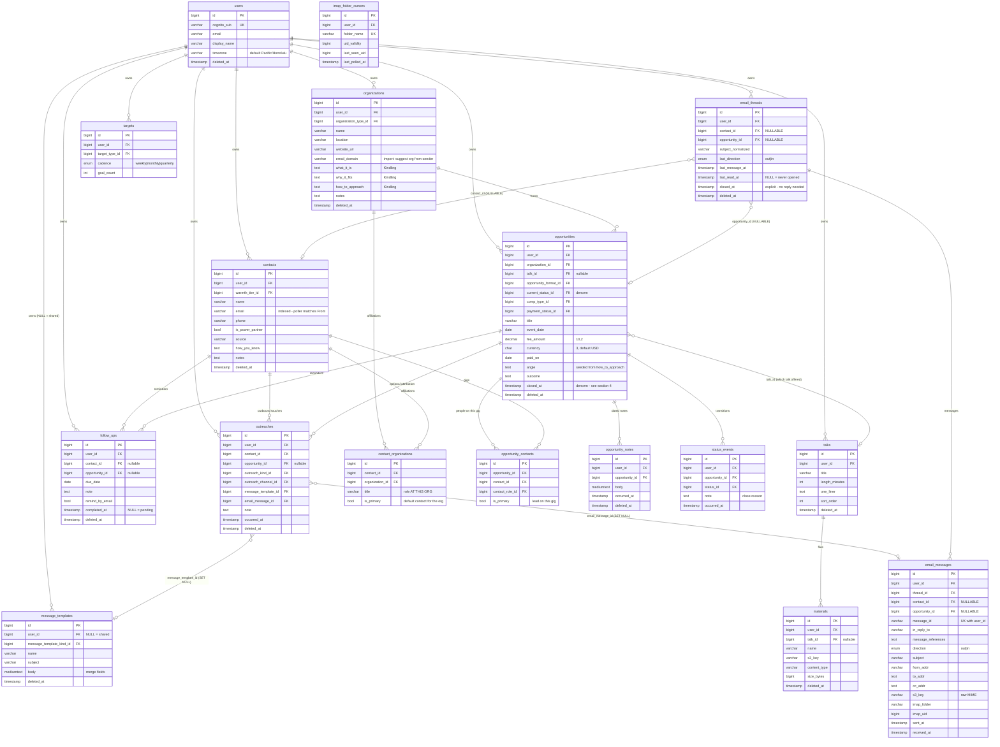

# Speaker Tracker — Database Schema

**MySQL 8.4.8** (`ENGINE=InnoDB DEFAULT CHARSET=utf8mb4 COLLATE=utf8mb4_0900_ai_ci`), schema
`speakertracker` on the shared `jobtracker-db` instance —
`db.t4g.micro`, 20 GB, publicly accessible with IAM auth enabled, in **us-west-2**, account
**381492047863**. Migrations live in `backend/src/migrations/*.sql`, applied forward-only in lexical
filename order by `handlers/migrate.py`, tracked in `schema_migrations`. IAM DB user:
`speakertracker_app`.

> **`db.t4g.micro` / 20 GB is shared with `jobtracker` and `legacytracker`.** This schema's volume is
> trivial (hundreds of opportunities, thousands of emails) — except `email_messages`, whose raw MIME
> is deliberately kept in **S3**, not the database. Keep it that way; a `MEDIUMTEXT` of raw MIME per
> message would exhaust 20 GB far faster than any other table here.

> **Status: pre-implementation.** No migration has been written yet. This document is the
> *target* schema — the contract migration `0001` onward must satisfy. It is derived from
> `DESIGN.md` §4/§5 and supersedes any older sketch.

**Conventions** (inherited from the sibling apps, see `CODING-GUIDELINES.md` §2):

- Every entity table carries `id BIGINT AUTO_INCREMENT PK`, `created_at`,
  `updated_at … ON UPDATE CURRENT_TIMESTAMP`, and `deleted_at TIMESTAMP NULL` (soft delete).
- `user_id → users(id)` is `ON DELETE CASCADE` everywhere (tenant root), even though the app is
  single-user today — it costs nothing now and is painful to retrofit.
- **Catalog tables, not ENUMs.** Every catalog shares
  `id / short_name UK / description / sort_order / created_at / updated_at / deleted_at`.
  Repositories resolve `short_name ↔ id` at the boundary so callers pass `short_name`.
  Two deliberate exceptions are noted in §5.
- Money is `DECIMAL(10,2)` — never `FLOAT`.

---

## 1. ER diagram

Catalog tables are drawn separately (§1.2) to keep the entity graph legible.

### 1.1 Entities



### 1.2 Catalogs

All share `id / short_name UK / description / sort_order / created_at / updated_at / deleted_at`;
extra columns noted.

```mermaid
erDiagram
    organization_types { bigint id PK }
    warmth_tiers { bigint id PK }
    contact_roles { bigint id PK }
    opportunity_statuses { bigint id PK }
    opportunity_formats { bigint id PK }
    comp_types { bigint id PK }
    payment_statuses { bigint id PK }
    outreach_kinds { bool counts_toward_target }
    outreach_channels { bigint id PK }
    message_template_kinds { bigint id PK }
    target_types { bigint id PK }
```



---

## 2. Entity tables

### `users`
Tenant root. `cognito_sub` UNIQUE — populated by the `post_confirmation` Lambda
(`INSERT … ON DUPLICATE KEY UPDATE`, idempotent). `timezone` defaults to `Pacific/Honolulu`;
the `X-User-Timezone` header still governs per-request `SET time_zone` (Kauaʻi is UTC-10, so
"today" rollover is 10 hours off UTC and every date-bucketed metric depends on it).

### `organizations`
Venues, orgs, podcasts, expos. Holds the three **Kindling** research columns from `DESIGN.md` §5
(`what_it_is`, `why_it_fits`, `how_to_approach`) as structured columns, *not* a notes blob —
research-readiness (§4) is computed from them.

`email_domain` exists for the drop-folder import: when an unknown sender is imported, the sender's
domain is matched here to suggest an existing organization before offering to create one.
Indexes: `(user_id, name)`, `(user_id, organization_type_id)`, `(user_id, email_domain)`.

### `contacts`
The *person*, deliberately with **no `organization_id`** — affiliation lives in
`contact_organizations`, because on Kauaʻi one person is frequently the contact for several venues.
`is_power_partner` is a person-level flag, independent of any org.

**`(user_id, email)` is a load-bearing index, not a convenience.** The IMAP poller resolves every
inbound `From` address against it on every poll to decide whether a message is in scope at all
(`DESIGN.md` §3). Without it the poller table-scans contacts once a minute.

> ⚠️ **Known limitation: one email address per contact.** A coordinator who writes from both
> `jane@venue.com` and a personal address will match only on the stored one; the second address
> lands in the unknown-sender import flow and, on import, offers to attach to the existing contact
> (dedupe) — but the address still isn't retained for future matching. If this bites in practice
> the fix is a `contact_email_addresses` child table; it is deliberately **not** built now.

### `contact_organizations`
Many-to-many affiliation. `UNIQUE(contact_id, organization_id)` — this is what makes the
add-contact dedupe flow safe: adding an existing person to a second venue creates a new
*affiliation*, never a duplicate contact. `title` is their role **at that org** ("Events Chair" at
PWN, "Member" at BNI). `is_primary` = the go-to contact for that org.

### `opportunities`
One row per gig / podcast spot. `current_status_id` is denormalized from the latest
`status_events` row and kept in sync by the API (never recomputed on read).

Money/lifecycle: `comp_type_id` (paid / pro_bono / trade), `fee_amount` + `currency`,
`payment_status_id`, `paid_on`. **Pro bono is first-class** — it still counts as a booking.

`closed_at` is denormalized; the predicate that drives it is in §4.
Indexes: `(user_id, closed_at)` — the board/History split, so it is on nearly every query —
plus `(user_id, current_status_id)`, `(user_id, event_date)`, `(organization_id)`.

### `opportunity_contacts`
Many-to-many with a `contact_role_id` (primary / introducer / backup / coordinator) and
`is_primary`. Covers the intro-chain case: an insider `introducer` plus the working `primary`.
`UNIQUE(opportunity_id, contact_id)`.

> **Two scoped meanings of "primary", labelled distinctly in the UI:**
> `contact_organizations.is_primary` = "Primary contact" (default contact for an org);
> `opportunity_contacts.is_primary` = "Lead on this gig". They are unrelated flags — do not
> conflate them in queries.

### `opportunity_notes`
Free-form **dated** notes (call outcomes, scheduling changes, prep) — distinct from the
`outreaches` touch journal and the `status_events` transition log. `occurred_at` is user-settable
(a note can record something that happened yesterday); `created_at` is not.

### `status_events`
Journal of pipeline transitions — one row per stage move, written on drag-and-drop and on close.
A row is inserted only when the new status differs from `opportunities.current_status_id`.
`note` carries the close reason for terminal transitions (Lost / Passed pre-booking,
Cancelled post-booking).

**`occurred_at` is the only trustworthy date the funnel has** (`updated_at` bumps on any edit), so
it is the source for every funnel ratio and every "entered stage X" count. Anything that needs to
be dated belongs here. Indexes: `(opportunity_id, occurred_at)`, `(user_id, status_id, occurred_at)`.

### `outreaches`
Append-only journal of **outbound** touches, logged against the *contact*, decoupled from pipeline
stage. `opportunity_id` is nullable (a touch need not belong to a gig).

> **Outbound only — this is load-bearing for metrics.** It is *out*reach: mail Donna **received**
> never creates a row here. Inbound remains fully visible in history via the union view in §4.
> Combined with `outreach_kinds.counts_toward_target`, this is what stops a four-message thread
> about parking logistics with an already-booked venue from scoring as four "outreaches" and
> turning the *outreaches/week* target into a measure of email volume.

`email_message_id` links an email touch to its message (`ON DELETE SET NULL`).
Indexes: `(user_id, occurred_at)`, `(contact_id, occurred_at)`,
`(user_id, outreach_kind_id, occurred_at)` — the last one serves the target rollups.

### `email_threads`
Thread identity, assigned **once at ingest** by the poller (which already holds the RFC 5322 header
chain) rather than re-derived per read. `subject_normalized` strips `Re:`/`Fwd:` prefixes and
collapses whitespace, and is the fallback grouping key when the `References` chain is broken by a
misbehaving client.

**`contact_id` and `opportunity_id` are both NULLABLE**, for three legitimate states:

| State | `contact_id` | `opportunity_id` |
|---|---|---|
| Unknown sender, dragged to `Import`, awaiting triage | NULL | NULL |
| Side-channel mail with a known contact, tied to no gig | set | NULL |
| Gig correspondence | set | set |

**Threads close explicitly** — `closed_at` is set by Donna ("no reply needed") or automatically
when the linked opportunity closes. Nothing infers that a sent message is owed a reply, so terminal
mail never nags. `last_read_at` drives the unread badge (`last_direction = 'in' AND (last_read_at
IS NULL OR last_read_at < last_message_at)`).
Indexes: `(user_id, closed_at, last_message_at)`, `(contact_id)`, `(opportunity_id)`.

### `email_messages`
One row per sent/received message. `references` is a reserved word in some tooling, so the column
is **`message_references`**.

**`UNIQUE(user_id, message_id)` is the idempotency key for the whole poller.** It is what makes a
re-dragged email, a redelivered IMAP fetch, or an overlapping poll structurally incapable of
double-inserting. `message_id` is `VARCHAR(255)` — comfortably above real-world Message-IDs and
within the InnoDB DYNAMIC 3072-byte index limit at utf8mb4.

`direction` is an `ENUM('out','in')` — see §5 for why this one is not a catalog.
`s3_key` points at the raw MIME (attachments are extracted from it, not stored separately).
`imap_folder` + `imap_uid` record provenance and support re-fetch.
Indexes: `(thread_id, COALESCE(sent_at, received_at))`, `(user_id, message_id)` UK,
`(in_reply_to)` — the reply-matching lookup.

### `follow_ups`
A future, actionable reminder — distinct from `outreaches` (past touches) and `opportunity_notes`
(dated commentary). `due_date` is an explicit calendar **DATE**, never a relative "in N days".

`completed_at NULL` **is** the pending/done state; there is no separate `status` column.
`DESIGN.md` §4 lists both, but two columns encoding one fact is a guaranteed drift bug — one of
them would eventually disagree with the other.

`CHECK (contact_id IS NOT NULL OR opportunity_id IS NOT NULL)` — a follow-up attached to nothing is
unreachable in the UI. Both are individually nullable (a gig-level reminder may name no person).

EventBridge Scheduler uses the deterministic schedule name **`followup-<id>`** (ported from
job-tracker), so create/update/delete need no state read-back.
Indexes: `(user_id, due_date, completed_at)` — the Dashboard's due list.

### `message_templates`
`user_id NULL` = shared template, editable in place (admin-gated under multi-user); **Duplicate**
writes a personal copy with `user_id` set. `body` holds merge fields (`[Name]`, …) resolved
client-side for the copy-to-clipboard DM flow.

### `targets`
`UNIQUE(user_id, target_type_id, cadence)` — the key the `PUT /targets` upsert
(`ON DUPLICATE KEY UPDATE`) depends on.

### `talks` / `materials`
The Guest Workshop menu. `materials.s3_key` is uploaded via presigned PUT; `talk_id` is nullable
so a general one-sheet can exist independent of a specific talk.

### `imap_folder_cursors`
Per-folder poll watermark, `UNIQUE(user_id, folder_name)`. Each poll fetches only UIDs above
`last_seen_uid`, which is what makes a 1-minute interval cheap — most polls touch zero messages.

> **`uid_validity` is not optional bookkeeping.** IMAP UIDs are only meaningful within a given
> `UIDVALIDITY`; if the server changes it (folder recreated, mailbox migrated), previously stored
> UIDs become meaningless and **the cursor must be reset** rather than trusted. Silently ignoring
> this is the classic IMAP poller bug — it either re-imports everything or skips mail forever.

---

## 3. Catalog vocabularies

| Table | `short_name` values | Extra columns |
|---|---|---|
| `organization_types` | retreat_venue, resort, yoga_studio, spa, womens_network, podcast, expo, corporate, other | — |
| `warmth_tiers` | cold, lukewarm, warm | — |
| `contact_roles` | primary, introducer, coordinator, backup | — |
| `opportunity_formats` | workshop, keynote, podcast_spot, expo_table, panel, other | — |
| `opportunity_statuses` | researching, outreach_sent, in_conversation, pitched, booked, delivered, nurture, cancelled, lost | `is_terminal`, `sort_order` |
| `comp_types` | paid, pro_bono, trade | — |
| `payment_statuses` | unbilled, invoiced, partial, paid, n_a | `is_settled` |
| `outreach_kinds` | initial, follow_up, correspondence | **`counts_toward_target`** |
| `outreach_channels` | email, dm, call, in_person, text | — |
| `message_template_kinds` | dm, email, power_partner | — |
| `target_types` | venues_researched, outreaches, pitches, bookings | — |

### `opportunity_statuses` — `sort_order` drives the funnel

| short_name | description | is_terminal | sort_order |
|---|---|---|---|
| researching | Researching | F | 10 |
| outreach_sent | Outreach Sent | F | 20 |
| in_conversation | In Conversation | F | 30 |
| pitched | Pitched | F | 40 |
| booked | Booked | F | 50 |
| delivered | Delivered | **T** | 60 |
| nurture | Nurture | F | 70 |
| cancelled | Cancelled | **T** | 80 |
| lost | Lost / Passed | **T** | 90 |

The four **funnel ratio stages** are `outreach_sent → in_conversation → pitched → booked` (10–50),
counted **reached-or-beyond** over `status_events.occurred_at`, so a gig that jumped straight to
Pitched still counts toward Outreach Sent.

Three notes on the ordering, because each is a trap:

- **`nurture` (70) sorts *after* `delivered` (60) and is deliberately non-terminal.** It is a
  post-delivery holding state, not an outcome. Per `DESIGN.md` §1 an opportunity **ends** at
  Delivered / Nurture — anything downstream is legacy-tracker's, and must not be modelled here.
- **`cancelled` still counts as a booking** for funnel purposes (it was booked, then fell through).
  The Dashboard funnel shows it as the leak between Booked and Delivered. Do **not** exclude it
  from the booked count.
- **`is_terminal` is genuinely consumed here**, unlike legacy-tracker where the equivalent flag is a
  documented dead column. It gates the `closed_at` predicate in §4 — do not assume it is decorative.

### `outreach_kinds.counts_toward_target`

| short_name | counts_toward_target | set when |
|---|---|---|
| initial | ✓ | first outbound touch to that contact |
| follow_up | ✓ | subsequent prospecting touch |
| correspondence | ✗ | logistics / admin on an existing conversation |

The composer **infers** the kind (`initial` if no prior outbound touch to the contact, else
`correspondence`) and shows it as an editable chip, so a genuine re-pitch to a cold contact can be
corrected to `follow_up`. Metric SQL joins this flag — it must never hardcode `short_name` values.

### `payment_statuses.is_settled`

`paid` and `n_a` are settled; `unbilled`, `invoiced`, `partial` are not. Pro bono and trade
opportunities are created with `n_a`. This flag exists so the §4 close predicate is catalog-driven
rather than a hardcoded `IN (...)` list.

---

## 4. Stored vs computed

**Stored / denormalized (API keeps in sync — never recomputed on read):**
`opportunities.current_status_id`, `opportunities.closed_at`, `email_threads.last_message_at`,
`email_threads.last_direction`, `imap_folder_cursors.last_seen_uid`.

### `closed_at` — the one predicate worth getting right

An opportunity is **closed** when it has reached a terminal status *and* money is settled:

```
closed  ⇔  (delivered AND payment_statuses.is_settled)
        ∨   cancelled
        ∨   lost
```

The payment gate applies **only to `delivered`**. This is deliberate: a delivered-but-unpaid gig
**stays on the active board** so it isn't lost before Donna collects. Cancelled and Lost close
immediately — there is nothing to collect.

`closed_at` is written by the API whenever a status or payment change makes the predicate true, and
cleared if it becomes false again (e.g. a payment status corrected back to `invoiced`). The board
filters `closed_at IS NULL`; History filters `closed_at IS NOT NULL`; the "Show closed" toggle
relaxes the board filter to a recent window.

> It is stored rather than a MySQL generated column because the predicate depends on
> `opportunity_statuses.is_terminal` and `payment_statuses.is_settled` — **columns in other
> tables**, which generated columns cannot reference.

### Computed on the fly (no backing column)

- **Contact timeline** — a read-time `UNION ALL` over `outreaches`, `email_messages`,
  `opportunity_notes`, and `status_events`, ordered by their respective timestamps. This view is
  what allows `outreaches` to stay outbound-only without losing unified history on the contact page.
- **Funnel ratios** — reached-or-beyond counts over `status_events` joined to
  `opportunity_statuses.sort_order`, reduced in SQL with a `CASE` + `GROUP BY`, not a Python pass.
- **Target actuals** — counts over `outreaches` (filtered by `counts_toward_target`),
  `organizations` (research-ready, below), `status_events` (pitched / booked), bucketed by the
  target's cadence in the **user's** timezone.
- **Research-readiness** — an org is "outreach-ready" when all three Kindling columns are non-empty
  *and* it has ≥1 affiliated contact. This is the quality bar for the *venues researched* target,
  so the target counts **ready** orgs, not merely created rows.
- **Thread status** — derived from `last_direction`, `last_message_at`, `last_read_at`, `closed_at`
  (see `email_threads`). There is no status column.
- **Money rollups** — Booked / Received / Outstanding and the pro-bono count, summed over
  `opportunities` by `comp_type_id` / `payment_status_id`.

**Config scalars (not aggregates):** `targets.goal_count`, `users.timezone`, catalog `sort_order`
and boolean flags.

---

## 5. Deliberate deviations

Two places where this schema departs from a convention or from `DESIGN.md`, with rationale:

1. **`ENUM` instead of a catalog — twice.** `targets.cadence` (`weekly|monthly|quarterly`) and
   `email_messages.direction` / `email_threads.last_direction` (`out|in`). A two- or three-row
   catalog with no extra columns and no prospect of user extension is overkill; job-tracker made
   the same call on `cadence` for the same reason. Every other vocabulary is a catalog.
2. **`follow_ups` has no `status` column** — `completed_at IS NULL` is the pending state.
   `DESIGN.md` §4 lists both `status` and `completed_at`; storing one fact in two columns
   guarantees they eventually disagree.

Also worth flagging for review rather than silently absorbing: `DESIGN.md` §4 calls
`message_templates.channel` a *channel*, but its values are `dm / email / power_partner` — and
`power_partner` is an audience, not a channel. Modelled here as
**`message_template_kinds`** (matching legacy-tracker's naming) with `outreach_channels` kept as
the separate, genuine channel vocabulary on `outreaches`.

---

## 6. Migration plan

Forward-only, one file per vertical slice from `DESIGN.md` §6, so a slice is deployable on its own:

| Migration | Contents | Slice |
|---|---|---|
| `0001_initial.sql` | `schema_migrations`, `users`, all catalog tables + seed rows | 1 |
| `0002_orgs_contacts.sql` | `organizations`, `contacts`, `contact_organizations` | 2 |
| `0003_pipeline.sql` | `opportunities`, `opportunity_contacts`, `opportunity_notes`, `status_events` | 3 |
| `0004_outreach.sql` | `outreaches`, `message_templates` + seed of the three strategy-doc templates | 4 |
| `0005_targets.sql` | `targets` | 5 |
| `0006_email.sql` | `email_threads`, `email_messages`, `imap_folder_cursors` | 6 |
| `0007_followups.sql` | `follow_ups` | 7 |
| `0008_assets.sql` | `talks`, `materials` | 2–4 (as needed) |

Catalog seed rows ship in `0001` even for tables whose entity arrives later — seeding is idempotent
(`INSERT … ON DUPLICATE KEY UPDATE` on `short_name`) and keeps vocabulary changes in one place.