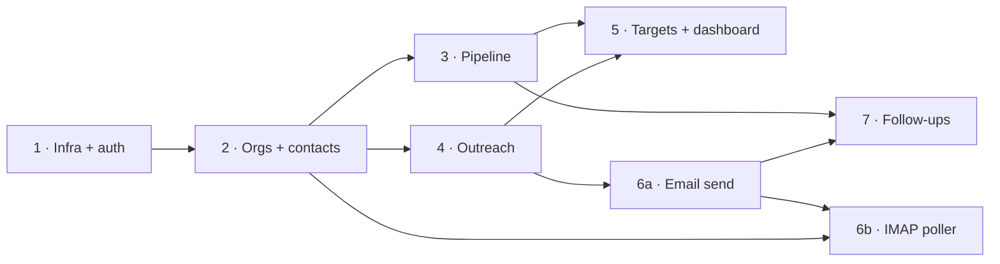

# Speaker Tracker — Development Plan

Execution plan for building the app described in `DESIGN.md`, on the schema in `DATABASE.md` and
the structure in `ARCHITECTURE.md`. Slice numbering follows `DESIGN.md` §6 — **do not renumber**,
other docs reference these numbers.

> **Status: nothing built.** The repo currently contains `docs/` and `samples/` only.

---

## 0. Pre-flight checks

External facts to verify **before** writing code. Each is cheap now and expensive to discover in
slice 6.

Verified 2026-07-18 against account **381492047863** (Brian). ✅ = resolved, no action.

| # | Check | Status | Blocks |
|---|---|---|---|
| P1 | WorkMail simultaneous-IMAP-connection quota | ✅ **10 per user+IP pair — non-binding.** Lambda outside a VPC draws rotating IPs and reserved concurrency 1 holds at most one connection, so the poller cannot contend with Outlook. 1-minute interval confirmed safe; the two-tier fallback stays unused | 6b |
| P2 | SES out of sandbox | ✅ **Granted us-east-1, 2026-07-18** — 50,000/day, 14 msg/s, `HEALTHY`. Domain identity `360balancedliving.com` already verified, DKIM `SUCCESS`. SPF includes `amazonses.com`; DMARC `p=none` | 6a |
| P3 | Exact WorkMail mailbox address; IMAP enabled | ✅ **`donna.king@360balancedliving.com`**, org alias `360-balanced-living` (`m-aa419e28e9c44881a91c711910d9b1b5`), us-east-1. IMAP `imap.mail.us-east-1.awsapps.com:993`. **No MFA** → plain username/password authenticates | 6a |
| P4 | IMAP credential → Secrets Manager | ✅ **Pattern settled:** CDK creates the `Secret` resource; the value is written once via `put-secret-value` (see slice 6a). No app-specific password needed | 6b |
| P5 | `jobtracker-db` headroom | ✅ MySQL **8.4.8**, `db.t4g.micro`, 20 GB, public + IAM auth, us-west-2. Master secret at `/jobtracker/data/db-master-secret-arn`. Keep raw MIME in S3, not MySQL | 1 |
| P6 | Hostname + Route53 zone | ✅ **`speaker-tracker.360balancedliving.com`**, zone `Z08490251WV9146J97IRG`, same account. Record does **not** exist yet — the Frontend stack creates it | 1 |
| P7 | Cognito Hosted UI domain prefix | ✅ **`speakertracker-app-381492047863`** — verified available, and matches legacy-tracker's `` `legacytracker-app-${this.account}` `` (`auth-stack.ts:74`) | 1 |
| P8 | Apex `MX` → `inbound-smtp.us-east-1.amazonaws.com` | ✅ **Explained** — that is the standard MX for a WorkMail-managed domain (WorkMail runs on SES). Brian's account has **no SES receipt rule sets** in us-east-1, so nothing of his touches her mail. *Optional confirm:* her account's active rule set is WorkMail's default and nothing copies mail to S3/Lambda — the never-the-whole-mailbox guarantee must hold below the app too | — |

**Nothing blocks slice 1.** All pre-flight items are resolved; the only outstanding action is
writing the IMAP secret value, which belongs to slice 6a.

**No cross-account IAM is needed anywhere.** Sending uses the domain identity already verified in
Brian's account (domain verification covers `donna@…`), and IMAP is username/password rather than
IAM. See `ARCHITECTURE.md` §4.

---

## Definition of done — every slice

A slice is not finished until all of these hold:

- Migration applied cleanly to **sandbox** by the in-deploy `Trigger`, and re-running it is a no-op.
- `ruff`, `pytest`, `tsc --noEmit` green in CI.
- NumPy docstrings on every public function/class; entry/exit logging with a correlation id on every
  handler, per `CODING-GUIDELINES.md` §5–6.
- `core/` logic for the slice has unit tests that touch **no database**.
- `DATABASE.md` / `ARCHITECTURE.md` diagrams updated **in the same commit** as any schema or module
  change — the guideline exists so docs can't drift.
- **Manually exercised in sandbox**, not merely unit-tested. Each slice below names what to drive.
- No file over ~300 lines without a deliberate reason (~500 = refactor now).

---

## Slice 1 — Infra skeleton, auth, health

**Size: L.** Everything downstream depends on this being right, and it is the only slice that is
almost pure setup.

**Repo scaffold**
```
backend/{src/{handlers,core,repositories,models,migrations,common},tests/unit}
frontend/src/{pages,components,api,auth}
infra/cdk/{lib,bin}
.github/workflows/ci.yml
```

**Migration `0001_initial.sql`** — `schema_migrations`, `users`, **all catalog tables + seed rows**
(including catalogs whose entity tables arrive in later slices; seeding is idempotent via
`INSERT … ON DUPLICATE KEY UPDATE` on `short_name`, and keeps vocabulary in one place).

> **Seeding policy, in force for every slice.** **Reference data ships** — catalog vocabularies, and
> the three strategy-doc message templates in slice 4. **Workflow data never does** — no venues, no
> contacts, no opportunities, in any environment including sandbox. Anything Donna would enter as
> part of doing the work, she enters. There is no import path and no demo dataset.

**Backend**
- `common/`: `db.py` (RDS IAM token, TLS, per-invocation connection, `finally` close), `http.py`
  (bare-JSON envelope **+ the catch-all 500 mapper**), `auth.py` (**with the import-time
  `AUTH_MODE=dev` ⇒ `ENV_TYPE=sandbox` assertion, ported verbatim**), `tz.py`, `logger.py`,
  `users.py` (`get_user_id`; `UserNotFoundError` → **404, not 500**).
- `handlers/`: `health.py`, `migrate.py`, `catalogs.py`, `post_confirmation.py`,
  `seed_sandbox_user.py` — creates an unauthenticated **`dev`** user for sandbox (a `users` row and
  nothing else), mirroring legacy-tracker's `DEV_USER_SUB` pattern. **No owned records.**

**Frontend**
- AppShell: navy nav rail, logo, light theme, Mantine provider, brand palette tokens.
- **No splash gate** — land on the shell with a header **Sign In**; content area prompts to sign in;
  deep link preserved across the redirect.
- `api/client.ts` — `useApi()` with Bearer JWT, `X-User-Timezone`, and **401 → `signinRedirect()`**.
- TanStack Query provider; `useCatalogs()` hook.
- Copy logo assets from `~/360-balanced-living/ghl/assets/images/logos/`.

**Infra — prod and sandbox stood up together**
- CDK app: `<env>-Auth` (invite-only: `selfSignUpEnabled: false`, `removalPolicy: RETAIN`),
  `<env>-Cert` (us-east-1), `<env>-Api` (`ROUTES` table + migrate `Trigger`), `<env>-Frontend`
  (Route53 alias for `speaker-tracker.360balancedliving.com` in zone `Z08490251WV9146J97IRG`).
- `shared-db.ts` referencing `/jobtracker/data/*`; `rds-db:connect` scoped by `DbiResourceId`.
- Sandbox with open gateway + `AUTH_MODE=dev`.
- CI: ruff, pytest, `tsc --noEmit` on PR/push. **No deploy step.**

> **Both environments ship in slice 1, deliberately.** Deploying them side by side surfaces
> environment-specific conflicts — the conditional JWT authorizer, the cross-region cert reference,
> the Route53 alias, divergent env vars — while slice 1 is still small enough to debug. Deferring
> prod to slice 5 would surface exactly those conflicts at the moment a real user is waiting.

**Acceptance**
1. `GET /api/health` returns 200 through CloudFront on **both** envs.
2. `https://speaker-tracker.360balancedliving.com` resolves, serves the SPA, and presents a valid
   certificate.
3. `GET /api/catalogs` returns every seeded vocabulary with `short_name`, `description`,
   `sort_order`, plus `counts_toward_target` on `outreach_kinds` and `is_settled` on
   `payment_statuses`.
4. Signing in through the Hosted UI creates a `users` row via `post_confirmation`; signing in again
   does **not** duplicate it.
5. Self-registration through the Hosted UI is **rejected**.
6. Deploying an `AUTH_MODE=dev` Lambda with `ENV_TYPE=prod` **fails at cold start**.
7. Closing the browser and reopening it leaves the user signed in.
8. **Prod requires auth and sandbox does not, across the same route set** — the conditional
   authorizer is the single difference, verified on both.
9. Sandbox resolves to the `dev` user, which owns **no** records.

**Verify manually:** sign in, hard-refresh a deep link while signed out, confirm redirect-back;
force-expire a token and confirm re-auth rather than a broken page.

---

## Slice 2 — Organizations + contacts

**Size: M.** First real CRUD; establishes the repository/core patterns every later slice copies.

**Migration `0002_orgs_contacts.sql`** — `organizations`, `contacts`, `contact_organizations`.
Includes the `(user_id, email)` index on contacts (the poller depends on it in 6b) and
`(user_id, email_domain)` on organizations.

**Backend** — `organizations.py`, `contacts.py`, `contact_organizations.py`;
`repositories/{organizations,contacts}.py`; `core/research.py` (readiness rule).

**Frontend** — Venues list + detail with the **Kindling research panel** (`what_it_is`,
`why_it_fits`, `how_to_approach`) and a research-ready indicator; Contacts list + detail showing
**multiple affiliations**; Add Venue / Add Contact modals.

> **No import path and no seeded venues or contacts** — in any environment, sandbox included. Donna
> enters venues as she researches them; the strategy doc's examples are illustrative, not a dataset.
> Slice 2 is pure CRUD.

**Acceptance**
1. A contact can be affiliated with **two organizations**, each with its own `title` and
   `is_primary`, and appears under both.
2. Add-contact runs a **dedupe search** first; adding an existing person to a second venue creates a
   new *affiliation*, not a duplicate contact.
3. `UNIQUE(contact_id, organization_id)` rejects a duplicate affiliation.
4. An org shows **outreach-ready** only when all three Kindling fields are non-empty **and** it has
   ≥1 affiliated contact.
5. Venue list shows the first line of `why_it_fits` as a scan column.
6. Soft delete hides rows everywhere without breaking existing affiliations.

**Verify manually:** create a person at one venue, then add them to a second via the dedupe path.

---

## Slice 3 — Pipeline board + status journal

**Size: L.** The board is the app's centre of gravity, and the optimistic-drag path is the fiddliest
frontend work in the project.

**Migration `0003_pipeline.sql`** — `opportunities`, `opportunity_contacts`, `opportunity_notes`,
`status_events`. **Plus `talks`** (resolving `DESIGN.md` §6's "as needed": `opportunities.talk_id` is
an FK, so `talks` cannot come later).

**Backend** — `opportunities.py` (incl. `PATCH /{id}/status`, `POST /{id}/close`),
`opportunity_contacts.py`, `opportunity_notes.py`, `talks.py`;
`core/opportunities.py` owning **status transitions and the `closed_at` predicate**;
`core/funnel.py` (server-owned stage order and labels).

**Frontend** — full-width kanban (dnd-kit) with **optimistic** move + rollback; money and payment
chips; per-card close ×; Show-closed toggle; Opportunity detail (fields, linked contacts with role
chips, dated notes, lifecycle); Close-opportunity modal (Lost/Passed pre-booking, Cancelled
post-booking); History table + detail via `?closed=true`.

**Acceptance**
1. Dragging a card writes **exactly one** `status_events` row and updates `current_status_id`; a
   drag to the same column writes none.
2. A failed status PATCH **rolls the card back** visually.
3. `closed_at` is set only when `(delivered AND settled) OR cancelled OR lost`.
4. **A delivered-but-unpaid gig stays on the board**; marking it paid moves it to History.
5. Correcting a payment status back from `paid` **clears `closed_at`** and returns the card.
6. Cancelled still counts as booked in the funnel; the Booked→Delivered leak is visible.
7. `nurture` is reachable and does **not** close the opportunity.
8. Closing writes a terminal `status_event` **and** a note capturing the reason.
9. Stage order/labels come from the server; no stage name is hardcoded in the SPA.

**Verify manually:** drive a gig end to end — research → booked → delivered → mark paid → confirm it
lands in History; then a second one to Cancelled.

---

## Slice 4 — Outreach log + templates

**Size: M.**

**Migration `0004_outreach.sql`** — `outreaches`, `message_templates` + seed of the three
strategy-doc templates (DM, formal email, power-partner DM) as **shared** rows (`user_id IS NULL`).
These are reference content Donna actually sends, not sample data — the one seeding exception
alongside the catalogs.

**Backend** — `outreaches.py`, `message_templates.py` (incl. duplicate);
`core/outreach.py` owning **kind inference**; contact-timeline union query.

**Frontend** — Log-outreach modal with channel, kind chip, note, optional opportunity;
template picker with **merge-field fill** and **Copy to clipboard** for the DM paste flow;
Templates page with in-place edit + Duplicate; contact timeline.

**Acceptance**
1. First outbound touch to a contact infers **`initial`**; a later one infers **`correspondence`**;
   the chip is editable and the override persists.
2. A touch with a `correspondence` kind **does not** move any target actual.
3. Merge fields resolve from the contact; Copy-to-clipboard yields the merged text.
4. Editing a shared template (`user_id IS NULL`) edits in place; Duplicate creates a personal copy.
5. The contact timeline interleaves outreaches, notes, and status events in one ordered list.
6. Logging outreach **never** changes pipeline stage — the two are decoupled.

**Verify manually:** log a DM via the template → clipboard → paste path exactly as Donna would.

---

## Slice 5 — Targets + dashboard

**Size: M.** First slice where the §2 f.8 measurement gap — the point of the app — actually closes.

**Migration `0005_targets.sql`** — `targets` with `UNIQUE(user_id, target_type_id, cadence)`.

**Backend** — `targets.py` (GET/PUT upsert on the unique key), `dashboard.py` (actuals vs targets,
funnel ratios, money rollups, stale opportunities, Needs attention).

**Frontend** — Targets page (weekly/monthly/quarterly); Dashboard with actual-vs-target tiles,
funnel, money card (Booked / Received / Outstanding + pro-bono count), stale list, Needs attention.

**Acceptance**
1. Actuals bucket by cadence in the **user's timezone** — a touch logged at 22:00 Kauaʻi time counts
   toward that Kauaʻi day, not the next UTC day.
2. `venues_researched` counts **outreach-ready** orgs, not merely created ones.
3. Funnel counts are **reached-or-beyond**: a gig that jumped straight to Pitched still counts toward
   Outreach Sent.
4. Only `counts_toward_target` kinds feed the outreaches target.
5. Money rollups exclude pro bono from currency totals but include it in the pro-bono count.
6. Overdue/awaiting payments appear as Needs-attention rows.

**Verify manually:** set a weekly target, log touches of each kind, confirm only the right ones move
the tile.

---

## Slice 6a — Email send path

**Size: L.** *Split from `DESIGN.md` §6's single slice 6 — the send and receive halves are
independently shippable, and shipping them together makes the first failure ambiguous.*

**Migration `0006_email.sql`** — `email_threads`, `email_messages`, `imap_folder_cursors`
(the cursor table ships here even though 6b uses it, to keep email schema in one migration).
**Plus `materials`** (attachments; resolves the other half of §6's "as needed").

**Backend** — `common/secrets.py` (module-scope cached — **first runtime secret in the family**),
`common/mail.py` (raw MIME, stable `Message-ID`, `In-Reply-To`/`References` on reply; **SES client
pinned to us-east-1**), `common/imap.py` (`APPEND` to `\Sent` **discovered via SPECIAL-USE**, folder
auto-create + `SUBSCRIBE`), `emails.py` (send/reply/thread read), `materials.py` (presigned PUT).
`<env>-Messaging` stack: IMAP secret; the SES identity is **referenced by ARN, never created** —
it is shared with other senders on the domain and a CDK-owned construct could delete a verification
others depend on.

**Unblocked:** SES production access granted us-east-1 (50,000/day, 14 msg/s); mailbox and IMAP
endpoint confirmed (P3), no MFA.

**One manual step in this slice** — after the Messaging stack creates the empty secret, write its
value once:
```
aws secretsmanager put-secret-value --secret-id speakertracker/imap \
  --secret-string '{"username":"donna.king@360balancedliving.com","password":"..."}' \
  --profile brian-admin --region us-west-2
```
CDK owns the resource; it never sees the password. A gitignored config read at synth time would
force `SecretValue.unsafePlainText()` and bake the password into `cdk.out/`, the staging bucket,
and CloudFormation.

**Frontend** — Tiptap composer with attachments; thread view; inline reply; Emails inbox.

**Acceptance**
1. A sent email arrives with correct DKIM and appears in **Donna's Outlook Sent folder**.
2. Sending writes `email_messages` + `email_threads` + `outreaches` **in one transaction**; a forced
   SES failure leaves **no** partial rows.
3. A reply sets `In-Reply-To` and `References` to the stored `Message-ID`.
4. `Speaker Tracker/Import` and `/Processed` are **auto-created and subscribed** on first connect,
   and **visible in Outlook** without manual subscription.
5. Deleting the Import folder and re-polling **recreates** it.
6. Attachments upload by presigned PUT and arrive intact.
7. The follow-up rider is **off by default**.

**Verify manually:** send to a real address, reply from it, confirm threading in the recipient's
client — not just in the app.

---

## Slice 6b — IMAP poller and inbound

**Size: L. Highest-risk slice in the project.**

**Backend** — `imap_poll.py` (EventBridge `rate(1 minute)`, **reserved concurrency 1**),
`core/email_threading.py` (**pure**: header matching, subject normalization, fallback matching),
`email_imports.py` (pending-import list + link-to-contact).
`<env>-Messaging` gains the poller and its rule.

**Frontend** — "N emails awaiting import" badge → **Add Contact prefilled from the `From` header**
(name, address, sender domain suggesting an existing org), routed through slice 2's dedupe;
unread/awaiting indicators; explicit **thread close** ("no reply needed").

**Acceptance**
1. A reply from a tracked contact links to the right thread **and opportunity** within ~1 minute.
2. Mail from a **non-tracked** address is **never ingested** — verify with a personal email.
3. Dragging an unknown sender's mail to `Import` produces a pending-import row, moves it to
   `Processed`, and badges the app.
4. Importing opens Add Contact prefilled; saving links contact **and** the whole thread.
5. **Re-dragging the same message creates no duplicate** (`UNIQUE(user_id, message_id)`).
6. Changing the folder's **`UIDVALIDITY` resets the cursor** rather than skipping or re-importing.
7. Two overlapping poll invocations cannot both process a message (reserved concurrency 1).
8. Inbound mail creates **no `outreaches` row** — targets are unmoved by receiving email.
9. A thread whose opportunity closes is **auto-closed**; a closed thread raises no Needs-attention.
10. The broken-`References` fallback (From + normalized subject + time window) threads correctly.
11. **A wrong IMAP password raises an alarm, not a silent no-op.** Deliberately break the secret
    value and confirm the failure surfaces — auth errors must be distinguishable from the transient
    network errors the poller retries. This is the project's worst failure mode: the poller keeps
    running on schedule, finds nothing, and inbound threading stops with no error anywhere. Brian
    being sole admin of Donna's account makes an unrelated password rotation *more* likely, not
    less.

**Verify manually:** the full loop — send from the app, reply from an external client, confirm it
lands on the opportunity; then drag a stranger's email into Import and complete the contact creation.

---

## Slice 7 — Follow-up reminders

**Size: S.** Smallest slice; deliberately last because it depends on contacts, opportunities, and
the composer all existing.

**Migration `0007_followups.sql`** — `follow_ups` with
`CHECK (contact_id IS NOT NULL OR opportunity_id IS NOT NULL)`.

**Backend** — `follow_ups.py`, `common/scheduler.py` (deterministic `followup-<id>`, no-op when
unconfigured), `followup_notify.py` (**never touches the DB** — payload carries everything).
`<env>-Messaging` gains the Scheduler group + exec role.

**Frontend** — follow-up creation standalone and as an opt-in rider; due list on the Dashboard;
mark done.

**Acceptance**
1. A follow-up scheduled for a date fires an SES email on that date in **Donna's timezone**.
2. Editing the date **cancels and recreates** the schedule; only one email fires.
3. Deleting a follow-up cancels its schedule; cancelling an already-fired one is harmless.
4. `completed_at` is the only done-state; marking done removes it from the Dashboard.
5. A follow-up attached to neither contact nor opportunity is **rejected by the CHECK**.
6. Sending an email with the rider **off** creates no follow-up.

**Verify manually:** schedule one for tomorrow, confirm the email arrives; then edit the date and
confirm only one fires.

---

## Sequencing and risk



Slices **3 and 4 can run in parallel** after 2 — they touch different tables and different pages.
Everything else is a chain.

**Risk register**

| Risk | Slice | Mitigation |
|---|---|---|
| ~~WorkMail IMAP connection quota unknown~~ | 6b | ✅ **Resolved** — 10 per user+IP; reserved concurrency 1 + rotating Lambda IPs make it non-binding |
| **Silent IMAP auth failure** — password rotated, poller finds nothing, nobody notices for weeks | 6b | Auth errors alarm rather than log-and-continue; acceptance #11 tests it by breaking the secret |
| UIDVALIDITY handling is the classic poller bug | 6b | Explicit acceptance test #6; unit-test the reset path |
| Optimistic drag desyncs from the status journal | 3 | Rollback on failure is acceptance #2; server owns ordering |
| Timezone bucketing (UTC-10) silently off by a day | 5 | Acceptance #1 uses a 22:00 local touch specifically |
| **One email address per contact** | 6b | Known limitation in `DATABASE.md`; second addresses fall to the import flow |
| Cold-start TLS to RDS is 2–6s | 1 | Accepted; first request after idle is slow by design |
| Partial write on email send | 6a | Single transaction is acceptance #2 |

**Deferred, deliberately:** multi-user and per-user mailbox connections; revenue targets (a new
`target_type` when wanted); `contact_email_addresses`; SES configuration sets for bounce/complaint
event tracking (worth adding once real outreach volume exists); a custom MAIL FROM subdomain for
tighter DMARC alignment (`bounce.360balancedliving.com` already exists in DNS but is not configured
on the identity — not a blocker at `p=none`); any listener-conversion concept — that is
legacy-tracker's, and `DESIGN.md` §1 forbids it here.

**Never:** sample or demo venues, contacts, or opportunities, in any environment. Reference data
(catalog vocabularies, the three shared message templates) is the sole exception.