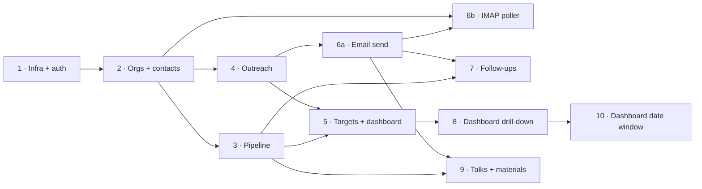

# Speaker Tracker — Development Plan

Execution plan for building the app described in `DESIGN.md`, on the schema in `DATABASE.md` and
the structure in `ARCHITECTURE.md`. Slice numbering follows `DESIGN.md` §6 — **do not renumber**,
other docs reference these numbers.

> **Status: slices 1–12 shipped (backend + frontend) and LIVE IN PRODUCTION.** Migrations
> `0001`–`0015` applied. Donna has been signed in at `https://speaker-tracker.360balancedliving.com`
> since 2026-08-03. Slice 12 (response counters) is merged and deployed. The slice sections below
> are kept as the record of what was decided and why — they are history, not a to-do list.

---

## 0. Pre-flight checks

External facts to verify **before** writing code. Each is cheap now and expensive to discover in
slice 6.

Verified 2026-07-18 against account **381492047863** (Brian). ✅ = resolved, no action.

| # | Check | Status | Blocks |
|---|---|---|---|
| P1 | WorkMail simultaneous-IMAP-connection quota | ✅ **10 per user+IP pair — non-binding.** Lambda outside a VPC draws rotating IPs and reserved concurrency 1 holds at most one connection, so the poller cannot contend with Outlook. 1-minute interval confirmed safe; the two-tier fallback stays unused | 6b |
| P2 | SES out of sandbox | ✅ **Granted us-east-1, 2026-07-18** — 50,000/day, 14 msg/s, `HEALTHY`. Domain identity `360balancedliving.com` already verified, DKIM `SUCCESS`. SPF includes `amazonses.com`; DMARC `p=none` | 6a |
| P3 | Exact WorkMail mailbox address; IMAP enabled | ✅ **`donna.king@360balancedliving.com`**, org alias `360-balanced-living` (`m-aa419e28e9c44881a91c711910d9b1b5`), us-east-1. IMAP `imap.mail.us-east-1.awsapps.com:993`. **No MFA** → plain username/password authenticates | 6a |
| P4 | IMAP credential → Secrets Manager | ✅ **Pattern settled:** CDK creates the `Secret` resource; the value is written once via `put-secret-value` (see slice 6a). No app-specific password needed | 6b |
| P5 | `jobtracker-db` headroom | ✅ MySQL **8.4.8**, `db.t4g.micro`, 20 GB, public + IAM auth, us-west-2. Master secret at `/jobtracker/data/db-master-secret-arn`. Keep raw MIME in S3, not MySQL | 1 |
| P6 | Hostname + Route53 zone | ✅ **`speaker-tracker.360balancedliving.com`**, zone `Z08490251WV9146J97IRG`, same account. Record does **not** exist yet — the Frontend stack creates it | 1 |
| P7 | Cognito Hosted UI domain prefix | ✅ **`speakertracker-app-381492047863`** — verified available, and matches legacy-tracker's `` `legacytracker-app-${this.account}` `` (`auth-stack.ts:74`) | 1 |
| P8 | Apex `MX` → `inbound-smtp.us-east-1.amazonaws.com` | ✅ **Explained** — that is the standard MX for a WorkMail-managed domain (WorkMail runs on SES). Brian's account has **no SES receipt rule sets** in us-east-1, so nothing of his touches her mail. *Optional confirm:* her account's active rule set is WorkMail's default and nothing copies mail to S3/Lambda — the never-the-whole-mailbox guarantee must hold below the app too | — |

**Nothing blocks slice 1.** All pre-flight items are resolved; the only outstanding action is
writing the IMAP secret value, which belongs to slice 6a.

**DB bootstrap: done** (2026-07-18). Schemas `speakertracker` and `speakertracker_sandbox` created,
user `speakertracker_app` created with `AWSAuthenticationPlugin`, `GRANT ALL` on both. Note the
`CREATE DATABASE` step is **undocumented in legacy-tracker's runbook** — its `db.py` passes
`database=DB_NAME` on connect, so the schema must exist before the first migration runs. Recorded
here so the gap isn't re-inherited.

### Verify before writing dependent code

| # | Check | If it fails |
|---|---|---|
| V1 | `SELECT COUNT(*) FROM mysql.time_zone_name` on `jobtracker-db` | If empty, `SET time_zone = 'Pacific/Honolulu'` errors and `tz.py` needs a numeric offset via `zoneinfo`. Safe for Honolulu (no DST); a real gap for any other zone |
| V2 | Cognito **Essentials** feature-plan MAU allowance | Managed Login branding requires Essentials, not Lite. Trivial at one user — confirm rather than assume $0 |
| V3 | Free memory on `db.t4g.micro` | RDS IAM auth wants 300–1000 MiB DB-side; the instance has 1 GiB shared with two other apps |
| V4 | PyMySQL TLS parameter names for the pinned version | `ssl_ca`/`ssl_verify_*` vs the legacy `ssl={...}` dict varies by version |
| V5 | `--only-binary=:all:` present in the uv bundle command | Without it uv silently builds an sdist for the *host* platform and ships x86 objects to an arm64 function — a runtime `invalid ELF header` instead of a build-time error |

**No cross-account IAM is needed anywhere.** Sending uses the domain identity already verified in
Brian's account (domain verification covers `donna@…`), and IMAP is username/password rather than
IAM. See `ARCHITECTURE.md` §4.

---

## Definition of done — every slice

A slice is not finished until all of these hold:

- Migration applied cleanly to **sandbox** by the in-deploy `Trigger`, and re-running it is a no-op.
- `ruff`, `pytest`, `tsc --noEmit` green in CI.
- NumPy docstrings on every public function/class; entry/exit logging with a correlation id on every
  handler, per `CODING-GUIDELINES.md` §5–6.
- `core/` logic for the slice has unit tests that touch **no database**.
- `DATABASE.md` / `ARCHITECTURE.md` diagrams updated **in the same commit** as any schema or module
  change — the guideline exists so docs can't drift.
- **Manually exercised in sandbox**, not merely unit-tested. Each slice below names what to drive.
- No file over ~300 lines without a deliberate reason (~500 = refactor now).

---

## Slice 1 — Infra skeleton, auth, health

**Size: L.** Everything downstream depends on this being right, and it is the only slice that is
almost pure setup.

**Repo scaffold**
```
backend/{src/{handlers,core,repositories,models,migrations,common},tests}
frontend/src/{pages,components,api,auth}
infra/cdk/{lib,bin}
.github/workflows/ci.yml
```

**Migration `0001_initial.sql`** — `users` + **all catalog tables and seed rows** (including catalogs
whose entity tables arrive in later slices; seeding is idempotent via
`INSERT … ON DUPLICATE KEY UPDATE` on `short_name`, and keeps vocabulary in one place).
**Not `schema_migrations`** — the runner bootstraps that table, because it must query it to decide
whether `0001` has already run. Every statement idempotent (`CREATE TABLE IF NOT EXISTS`), since
MySQL cannot roll back a partially-applied file. See `DATABASE.md` §6.

> **Seeding policy, in force for every slice.** **Reference data ships** — catalog vocabularies, and
> the three strategy-doc message templates in slice 4. **Workflow data never does** — no venues, no
> contacts, no opportunities, in any environment including sandbox. Anything Donna would enter as
> part of doing the work, she enters. There is no import path and no demo dataset.

**Backend**
- `common/`: `db.py` (RDS IAM token, TLS with `ssl_verify_identity`, **module-scope connection reuse**
  with the `SET time_zone` liveness probe and a single reconnect; `ping(reconnect=True)` banned),
  `http.py` (bare-JSON envelope **+ the catch-all 500 mapper**), `auth.py` (**with the import-time
  `AUTH_MODE=dev` ⇒ `ENV_TYPE=sandbox` assertion**), `tz.py`, `logger.py`, `errors.py`.
- `repositories/users.py`: `upsert_user_id` — idempotent, race-safe upsert (the source of truth for
  a user row, **not** `post_confirmation`); `UserNotFoundError` maps **404, not 500** in `http.py`.
- `app.py` + `api_handler.py`: one Powertools resolver, `handlers/` as `Router` modules, a single
  catch-all exception handler on `app`, and entry/exit logging wrapping `app.resolve` in the handler.
- `migrations/runner.py`: `GET_LOCK` advisory lock, checksum integrity gate, `sqlparse.split()`,
  one statement at a time. Takes `(connection, migrations_dir)` as parameters so tests drive it.
- **Packaging:** `uv` with `--python-platform aarch64-manylinux2014 --only-binary=:all:`, bundled
  per function (no layer — layers earn their keep at 10+ functions; there are 3).
- `handlers/`: `health.py`, `migrate.py`, `catalogs.py`. (No `seed_sandbox_user` — the sandbox
  `dev` user's `users` row is created lazily by the first authenticated request, same as any real
  user; the legacy-tracker `DEV_USER_SUB` seed pattern is obsolete given the lazy upsert.)

**Frontend**
- AppShell: navy nav rail, logo, light theme, Mantine provider, brand palette tokens.
- **No splash gate** — land on the shell with a header **Sign In**; content area prompts to sign in;
  deep link preserved across the redirect.
- `api/client.ts` — `useApi()` with Bearer JWT, `X-User-Timezone`, and **401 → `signinRedirect()`**.
- TanStack Query provider; `useCatalogs()` hook.
- Copy logo assets from `~/360-balanced-living/ghl/assets/images/logos/`.

**Infra — prod and sandbox stood up together**
- CDK app: `Prod-Auth` (invite-only: `selfSignUpEnabled: false`, `removalPolicy: RETAIN`, **Managed
  Login + Essentials + `CfnManagedLoginBranding`**), `Prod-Cert` (us-east-1, `crossRegionReferences`
  and explicit `env` on both stacks), `<env>-Api` (explicit routes → authorizer table + migrate
  `Trigger`), `<env>-Frontend` (Route53 alias via `fromHostedZoneAttributes`, **not `fromLookup`**,
  so `cdk synth` needs no credentials in CI).
- **Sandbox gets no Cert/Auth/Route53** — default `*.cloudfront.net`, open gateway, `AUTH_MODE=dev`.
- CloudFront: OAC for S3, `/api/*` with `ALL_VIEWER_EXCEPT_HOST_HEADER` + `CACHING_DISABLED`,
  **no `errorResponses`** — SPA fallback is a per-behavior CloudFront Function, because
  `errorResponses` is distribution-wide and would rewrite API 401s into HTML with status 200.
- `shared-db.ts` referencing `/jobtracker/data/*`; `rds-db:connect` scoped by `DbiResourceId`.
- CI: `ruff check`, `ruff format --check`, pytest (`mysql:8.4` service container), `tsc --noEmit`,
  `cdk synth`. **No deploy step.** `core/.ruff.toml` bans `boto3`/`pymysql`/`aws_lambda_powertools.event_handler`/`os.environ`,
  and `common/.ruff.toml` bans upward imports (`repositories`/`handlers`/`models`/`migrations`), so
  layer purity is a CI failure, not a review argument.

> **Both environments ship in slice 1, deliberately.** Deploying them side by side surfaces
> environment-specific conflicts — the conditional JWT authorizer, the cross-region cert reference,
> the Route53 alias, divergent env vars — while slice 1 is still small enough to debug. Deferring
> prod to slice 5 would surface exactly those conflicts at the moment a real user is waiting.

**Acceptance**
1. `GET /api/health` returns 200 through CloudFront on **both** envs.
2. `https://speaker-tracker.360balancedliving.com` resolves, serves the SPA, and presents a valid
   certificate.
3. `GET /api/catalogs` returns every seeded vocabulary with `short_name`, `description`,
   `sort_order`, plus `counts_toward_target` on `outreach_kinds` and `is_settled` on
   `payment_statuses`.
4. Signing in results in **exactly one** `users` row; signing in again does not duplicate it.
   *(Stated as an outcome, not a mechanism: `post_confirmation` has a hard 5s timeout against a
   2–6s cold TLS handshake, and `AdminCreateUser` creates users already-confirmed, so the trigger
   may never fire. The API's lazy idempotent upsert is the source of truth.)*
5. Self-registration through the Hosted UI is **rejected**.
6. Deploying an `AUTH_MODE=dev` Lambda with `ENV_TYPE=prod` **fails at cold start**.
7. Closing the browser and reopening it leaves the user signed in.
8. **Prod requires auth and sandbox does not, across the same route set** — the conditional
   authorizer is the single difference, verified on both.
9. Sandbox resolves to the `dev` user, which owns **no** records.

**Verify manually:** sign in, hard-refresh a deep link while signed out, confirm redirect-back;
force-expire a token and confirm re-auth rather than a broken page.

---

## Slice 2 — Organizations + contacts

**Size: M.** First real CRUD; establishes the repository/core patterns every later slice copies.

**Migration `0002_orgs_contacts.sql`** — `organizations`, `contacts`, `contact_organizations`.
Includes the `(user_id, email)` index on contacts (the poller depends on it in 6b) and
`(user_id, email_domain)` on organizations.

**Backend** — `organizations.py`, `contacts.py`, `contact_organizations.py`;
`repositories/{organizations,contacts}.py`; `core/research.py` (readiness rule).

**Frontend** — Venues list + detail with the **Kindling research panel** (`what_it_is`,
`why_it_fits`, `how_to_approach`) and a research-ready indicator; Contacts list + detail showing
**multiple affiliations**; Add Venue / Add Contact modals.

> **No import path and no seeded venues or contacts** — in any environment, sandbox included. Donna
> enters venues as she researches them; the strategy doc's examples are illustrative, not a dataset.
> Slice 2 is pure CRUD.

**Acceptance**
1. A contact can be affiliated with **two organizations**, each with its own `title` and
   `is_primary`, and appears under both.
2. Add-contact runs a **dedupe search** first; adding an existing person to a second venue creates a
   new *affiliation*, not a duplicate contact.
3. `UNIQUE(contact_id, organization_id)` rejects a duplicate affiliation.
4. An org shows **outreach-ready** only when all three Kindling fields are non-empty **and** it has
   ≥1 affiliated contact.
5. Venue list shows the first line of `why_it_fits` as a scan column.
6. Soft delete hides rows everywhere without breaking existing affiliations.

**Verify manually:** create a person at one venue, then add them to a second via the dedupe path.

---

## Slice 3 — Pipeline board + status journal

**Size: L.** The board is the app's centre of gravity, and the optimistic-drag path is the fiddliest
frontend work in the project.

**Migration `0003_pipeline.sql`** — `opportunities`, `opportunity_contacts`, `opportunity_notes`,
`status_events`. **Plus `talks`** (resolving `DESIGN.md` §6's "as needed": `opportunities.talk_id` is
an FK, so `talks` cannot come later).

**Backend** — `opportunities.py` (incl. `PATCH /{id}/status`, `PATCH /{id}/payment`, `POST /{id}/close`, `GET /funnel`),
`opportunity_contacts.py`, `opportunity_notes.py`, `talks.py`;
`core/opportunities.py` owning **status transitions and the `closed_at` predicate**;
`core/funnel.py` (server-owned stage order and labels).

**Frontend** — full-width kanban (dnd-kit) with **optimistic** move + rollback; money and payment
chips; per-card close ×; Show-closed toggle; Opportunity detail (fields, linked contacts with role
chips, dated notes, lifecycle); Close-opportunity modal (Lost/Passed pre-booking, Cancelled
post-booking); History table + detail via `?closed=true`.

**Acceptance**
1. Dragging a card writes **exactly one** `status_events` row and updates `current_status_id`; a
   drag to the same column writes none.
2. A failed status PATCH **rolls the card back** visually.
3. `closed_at` is set only when `(delivered AND settled) OR cancelled OR lost`.
4. **A delivered-but-unpaid gig stays on the board**; marking it paid moves it to History.
5. Correcting a payment status back from `paid` **clears `closed_at`** and returns the card.
6. Cancelled still counts as booked in the funnel; the Booked→Delivered leak is visible.
7. ~~`nurture` is reachable and does **not** close the opportunity.~~ *(retired in `0004_remove_nurture.sql` — the pipeline ends at Delivered; keeping a relationship warm lives on the contact/venue and follow-ups.)*
8. Closing writes a terminal `status_event` **and** a note capturing the reason.
9. Stage order/labels come from the server; no stage name is hardcoded in the SPA.

**Verify manually:** drive a gig end to end — research → booked → delivered → mark paid → confirm it
lands in History; then a second one to Cancelled.

---

## Slice 4 — Outreach log + templates

**Size: M.**

**Migration `0005_outreach.sql`** — `outreaches`, `message_templates` + seed of the three
strategy-doc templates (DM, formal email, power-partner DM) as **shared** rows (`user_id IS NULL`).
These are reference content Donna actually sends, not sample data — the one seeding exception
alongside the catalogs.

**Backend** — `outreaches.py`, `message_templates.py` (incl. duplicate);
`core/outreach.py` owning **kind inference**; contact-timeline union query.

**Frontend** — Log-outreach modal with channel, kind chip, note, optional opportunity;
template picker with **merge-field fill** and **Copy to clipboard** for the DM paste flow;
Templates page with in-place edit + Duplicate; contact timeline.

**Acceptance**
1. First outbound touch to a contact infers **`initial`**; a later one infers **`correspondence`**;
   the chip is editable and the override persists.
2. A touch with a `correspondence` kind **does not** move any target actual.
3. Merge fields resolve from the contact; Copy-to-clipboard yields the merged text.
4. Editing a shared template (`user_id IS NULL`) edits in place; Duplicate creates a personal copy.
5. The contact timeline interleaves outreaches, notes, and status events in one ordered list.
6. Logging outreach **never** changes pipeline stage — the two are decoupled.

**Verify manually:** log a DM via the template → clipboard → paste path exactly as Donna would.

---

## Slice 5 — Targets + dashboard

**Size: M.** First slice where the §2 f.8 measurement gap — the point of the app — actually closes.

**Migration `0006_targets.sql`** — `targets` with `UNIQUE(user_id, target_type_id, cadence)`.

**Backend** — `targets.py` (GET/PUT upsert on the unique key), `dashboard.py` (actuals vs targets,
funnel ratios, money rollups, stale opportunities, Needs attention).

**Frontend** — Targets page (weekly/monthly/quarterly); Dashboard with actual-vs-target tiles,
funnel, money card (Booked / Received / Outstanding + pro-bono count), stale list, Needs attention.

**Acceptance**
1. Actuals bucket by cadence in the **user's timezone** — a touch logged at 22:00 Kauaʻi time counts
   toward that Kauaʻi day, not the next UTC day.
2. `venues_researched` counts **outreach-ready** orgs, not merely created ones.
3. Funnel counts are **reached-or-beyond**: a gig that jumped straight to Pitched still counts toward
   Outreach Sent.
4. Only `counts_toward_target` kinds feed the outreaches target.
5. Money rollups exclude pro bono from currency totals but include it in the pro-bono count.
6. Overdue/awaiting payments appear as Needs-attention rows.

**Verify manually:** set a weekly target, log touches of each kind, confirm only the right ones move
the tile.

---

## Slice 6a — Email send path

**Size: L.** *Split from `DESIGN.md` §6's single slice 6 — the send and receive halves are
independently shippable, and shipping them together makes the first failure ambiguous.*

**Migration `0008_email.sql`** — `email_threads`, `email_messages`, `imap_folder_cursors`
(the cursor table ships here even though 6b uses it, to keep email schema in one migration).
`materials` (attachments) is **not** folded in here — it ships in its own `0010_materials.sql`
(DATABASE.md §6).

**Backend** — `common/secrets.py` (module-scope cached — **first runtime secret in the family**),
`common/mail.py` (raw MIME, stable `Message-ID`, `In-Reply-To`/`References` on reply; **SES client
pinned to us-east-1**), `common/imap.py` (`APPEND` to `\Sent` **discovered via SPECIAL-USE**, folder
auto-create + `SUBSCRIBE`), `emails.py` (send/reply/thread read), `materials.py` (presigned PUT).
`<env>-Messaging` stack: IMAP secret; the SES identity is **referenced by ARN, never created** —
it is shared with other senders on the domain and a CDK-owned construct could delete a verification
others depend on.

**Unblocked:** SES production access granted us-east-1 (50,000/day, 14 msg/s); mailbox and IMAP
endpoint confirmed (P3), no MFA.

**One manual step in this slice** — after the Messaging stack creates the empty secret, write its
value once:
```
aws secretsmanager put-secret-value --secret-id speakertracker/imap \
  --secret-string '{"username":"donna.king@360balancedliving.com","password":"..."}' \
  --profile brian-admin --region us-west-2
```
CDK owns the resource; it never sees the password. A gitignored config read at synth time would
force `SecretValue.unsafePlainText()` and bake the password into `cdk.out/`, the staging bucket,
and CloudFormation.

**Frontend** — Tiptap composer with attachments; thread view; inline reply; Emails inbox.

**Acceptance**
1. A sent email arrives with correct DKIM and appears in **Donna's Outlook Sent folder**.
2. Sending records **intent first**: `email_messages` (`sent_at` NULL) + `email_threads` +
   `outreaches` are written **in one transaction before** the SES call; a second transaction sets
   `sent_at` once SES accepts. A forced SES failure runs the **compensating delete** and leaves
   **no** rows. A crash between the SES call and the confirm leaves the message *pending*
   (`direction='out' AND sent_at IS NULL`) rather than losing it — 6b's Sent-folder poller
   reconciles it on `Message-ID`.
3. A reply sets `In-Reply-To` and `References` to the stored `Message-ID`.
4. Attachments upload by presigned PUT and arrive intact.
5. *(was #4/#5 — the `Speaker Tracker/Import` + `/Processed` folder criteria)* **Moved to 6b.**
   The folder helpers (`common/imap.py`: SPECIAL-USE discovery, delimiter detection, idempotent
   create + `SUBSCRIBE`) ship here and are unit-tested, but **6a never calls them** — the send path
   only appends to Sent. The criteria are poller behaviour ("on first connect", "re-polling
   recreates it"), so they are verified in 6b where the poller exists.
6. *(was #7 — the follow-up rider)* **Deferred with `follow_ups`.** That table arrives in a later
   migration, so 6a ships with no rider at all rather than a control wired to nothing. Record this
   as deferred, not verified.

**Verify manually:** send to a real address, reply from it, confirm threading in the recipient's
client — not just in the app.

---

## Slice 6b — IMAP poller and inbound

**Size: L. Highest-risk slice in the project.**

**Backend** — `imap_poll.py` (EventBridge `rate(1 minute)`, **reserved concurrency 1**),
`core/email_headers.py`, `core/email_threading.py`, `core/email_scope.py`, `core/imap_cursor.py`
(**all pure**: header matching and address normalization, thread resolution, inbound scoping, UID
cursor planning), `email_imports.py` (pending-import list + link-to-contact).
`<env>-Api` gains the poller and its EventBridge rule — **not** `<env>-Messaging`. The poller needs
the ContentBucket for raw inbound MIME, which lives in Api alongside `backendBundle()`,
`SharedDatabase`, and the `migrate` precedent for a non-API function. Messaging stays secret-only,
importing and exporting nothing.

**Frontend** — "N emails awaiting import" badge → **Add Contact prefilled from the `From` header**
(name, address, sender domain suggesting an existing org), routed through slice 2's dedupe;
unread/awaiting indicators; explicit **thread close** ("no reply needed"); and a
**link-this-thread-to-a-gig** control. That last one is not optional: an inbound-first thread gets
`opportunity_id = NULL` unconditionally (a lone open opportunity is no guarantee the mail is about
it), so without a manual control such a thread can never reach an opportunity at all.

**Acceptance** — ✅ = demonstrated on the real mailbox in sandbox (2026-07-29); see the
verification notes after the list.

1. ✅ A reply from a tracked contact links to the right thread **and opportunity** within ~1 minute.
2. ✅ Mail from a **non-tracked** address is **never ingested** — verify with a personal email.
3. ✅ Dragging an unknown sender's mail to `Import` produces a pending-import row, moves it to
   `Processed`, and badges the app.
4. ✅ Importing opens Add Contact prefilled; saving links contact **and** the whole thread.
5. ✅ **Re-dragging the same message creates no duplicate** (`UNIQUE(user_id, message_id)`).
6. ✅ Changing the folder's **`UIDVALIDITY` resets the cursor** rather than skipping or re-importing.
7. ✅ Two overlapping poll invocations cannot both process a message (reserved concurrency 1).
8. ◻ Inbound mail creates **no `outreaches` row** — targets are unmoved by receiving email. Nor does
   a message the poller discovers in `Sent` because it was composed in Outlook: **all outreach
   counting originates inside the app.** A touch that appears in the journal without Donna having
   logged or sent it from here is unexplainable from her side, and an unexplainable number is worse
   than a low one.
9. ◻ A thread whose opportunity closes is **auto-closed**; a closed thread raises no Needs-attention.
10. ◻ The broken-`References` fallback (From + normalized subject + time window) threads correctly.
11. ✅ **A wrong IMAP password raises an alarm, not a silent no-op.** Deliberately break the secret
    value and confirm the failure surfaces — auth errors must be distinguishable from the transient
    network errors the poller retries. This is the project's worst failure mode: the poller keeps
    running on schedule, finds nothing, and inbound threading stops with no error anywhere. Brian
    being sole admin of Donna's account makes an unrelated password rotation *more* likely, not
    less.
12. ◑ *(moved from 6a)* `Speaker Tracker/Import` and `/Processed` are **auto-created and subscribed**
    on the poller's first connect, and **visible in Outlook** without manual subscription —
    `SUBSCRIBE` is what makes them appear; creating them is not enough.
13. ✅ *(moved from 6a)* Deleting the Import folder and re-polling **recreates** it.

**Verification notes (2026-07-29, sandbox against the real mailbox).** ✅ = demonstrated live;
◑ = partly; ◻ = covered by mutation-checked tests but not separately observed live.

- **#6 could not be triggered naturally and was verified by simulation.** WorkMail preserves
  `UIDVALIDITY` *and* UID numbering across a folder delete/recreate — rebuilding `Import` returned
  `uidvalidity=1, uidnext=38459`, continuous with the pre-delete 38458 — so the reset path never
  fires on this server. Setting `imap_folder_cursors.uid_validity` to a wrong value is a *faithful*
  substitute rather than a fudge: the poller cannot distinguish "the server changed its generation"
  from "the stored value differs", because comparing those two numbers is the whole mechanism.
  Observed `resume → uidvalidity_changed (floor 0) → resume`, i.e. it reset **once** and re-synced,
  which is what separates a working reset from a poller stuck rescanning forever.
- **#11 needed a cold start, and its absence looked like a failure.** Editing the secret alone
  produced no errors, because `common/secrets.py` caches it at module scope and a warm container
  never re-reads it. This does not weaken the alarm: in a real rotation the *mailbox* rejects the
  cached password, so the auth path fires regardless. Once a deploy forced a new container the full
  chain ran — reject → refresh-and-retry → reject → invocation fails → `Errors` → `ALARM` → email —
  and after the secret was fixed the `refresh=True` retry recovered it with **no redeploy**, with
  the alarm returning to `OK` (which matters: SNS notifies only on transitions, so an alarm stuck in
  ALARM would swallow the next real failure).
- **#12 is ◑ because imports were done in WorkMail webmail, which lists folders regardless of
  subscription state.** Creation is verified in the logs; the "visible without manual subscription"
  half needs a client that filters by the subscription list (Outlook, Thunderbird).
- **#8 is implicitly true** — no `outreaches` row exists from any of the inbound traffic — but was
  not asserted as its own live check.
- **⚠ Latent risk, never hit:** `fetch_messages` pulls all capped UIDs in a **single** `FETCH`, so a
  200-message batch that cannot transfer within the 120s timeout would fail, never advance the
  cursor, and retry that same batch forever — a stall that emits an alarm every cycle. This is why a
  `UIDVALIDITY` reset should not be pointed at INBOX (6,286 messages) casually. If it ever bites,
  lower `MAX_UIDS_PER_POLL` or fetch in sub-batches.

*(#12/#13 were filed under 6a, but the helpers there are never called by the send path — they are
poller behaviour. `common/imap.py` already ships `ensure_app_folders`, SPECIAL-USE discovery and
server-delimiter detection, unit-tested; 6b wires them to the poll loop. Verified live against the
real mailbox on 2026-07-26: the Sent folder is `Sent Items` — discovered by its `\Sent` flag, since
no folder named `Sent` exists — and the hierarchy delimiter is `/`.)*

**Verify manually:** the full loop — send from the app, reply from an external client, confirm it
lands on the opportunity; then drag a stranger's email into Import and complete the contact creation.

---

## Slice 7 — Follow-up reminders

**Size: S.** Smallest slice; deliberately last because it depends on contacts, opportunities, and
the composer all existing.

**Migration `0010_followups.sql`** — `follow_ups` with
`CHECK (contact_id IS NOT NULL OR opportunity_id IS NOT NULL)`. **Not `0009`** — slice 6b took that
number for `0009_external_message_id.sql`, so this shifted by one; `DATABASE.md`'s migration table
is the authority on what is already claimed.

**Backend** — `follow_ups.py`, `common/scheduler.py` (deterministic `followup-<id>`, no-op when
unconfigured), `followup_notify.py` (**never touches the DB** — payload carries everything).

`<env>-Api` gains the Scheduler group, the exec role **and the notify function** — **not**
`<env>-Messaging`, which is what this line said before. The same correction the poller needed above
(§"Slice 6b"), for the same reason: Messaging was deliberately built to import and export nothing,
so siting these there would force Api to take cross-stack references to the group name and role
ARN — the weak-reference shape that left the CloudFront origin pointing at a deleted API on
2026-07-25. Api already has `backendBundle()`, the SES grant, and two non-API-function precedents
(`migrate`, `imap_poll`). Settled with Brian 2026-07-29.

**Frontend** — follow-up creation standalone and as an opt-in rider; due list on the Dashboard; a
dedicated **Follow-ups page** for everything the Dashboard card omits; mark done.

**Acceptance** — ✅ **all seven met** (2026-08-01; #1 against real EventBridge and a real inbox).
1. A follow-up scheduled for a date fires an SES email on that date in **Donna's timezone**.
2. Editing the date **cancels and recreates** the schedule; only one email fires. *Broader in
   practice: **any** field the email renders forces the replace, not only the date — the note and
   the contact/opportunity labels are equally baked into the frozen payload.*
3. Deleting a follow-up cancels its schedule; cancelling an already-fired one is harmless.
4. `completed_at` is the only done-state; marking done removes it from the Dashboard.
5. A follow-up attached to neither contact nor opportunity is **rejected by the CHECK**.
6. Sending an email with the rider **off** creates no follow-up.
7. **Marking a follow-up done cancels its schedule.** Added during design and easy to miss: because
   `followup_notify` never reads the database, a completed follow-up whose schedule survived would
   email Donna about something she has already finished — the app nagging her, which is the worst
   failure this slice can produce. #3 covers delete and #4 covers the Dashboard, but neither covers
   this.

**Verify manually:** schedule one for tomorrow, confirm the email arrives; then edit the date and
confirm only one fires.

**How #1 was actually verified**, since "wait until tomorrow" hides two traps. The sandbox dev
principal's email was a non-deliverable placeholder, so a sandbox reminder could never arrive —
`DEV_USER_EMAIL` is now overridable for exactly this. And an undeliverable reminder does not fail
quietly: it retries and dead-letters, so the retry budget matters before you leave one running
overnight. With both fixed, the reminder fired at **07:00:42 HST** on its due date and was
delivered. See `ARCHITECTURE.md` §5.2.

---

## Slice 8 — Dashboard drill-down (+ reporting enhancements)

**Size: M.** Post-6 polish; depends on slice 5's dashboard and the summary lists (Pipeline, History,
Contacts, Venues) gaining their filter rows in the UX-reconciliation pass.

Every Dashboard element that represents an **aggregate** — a target tile, a funnel-stage bar, a money
figure, the pro-bono count, a Needs-attention or Coming-up row — becomes **clickable**, opening the
relevant existing summary list **filtered to the exact set of records that make up that aggregate**.
The dashboard stops being a dead-end readout and becomes the entry point into the lists. Requires the
list pages to accept filter state via query params (the filter rows built during UX reconciliation).

**Related (same shape of work — parameterize the dashboard queries + add UX):** windowed totals —
display the money/funnel aggregates over a **selectable window** (weekly / monthly / quarterly /
annual, aligned to the target cadences) with a window picker. The data model already supports it
since everything is dated; `core/periods.py` already has the period math.

**Acceptance**
1. Clicking a funnel stage opens the Pipeline filtered to gigs at-or-beyond that stage; the row count
   matches the aggregate.
2. Clicking "Outstanding" opens the list filtered to invoiced-unpaid gigs.
3. Clicking a target tile opens the list of records counted toward that target in the period.

---

## Slice 9 — Talks & Materials

**Size: M.** The last nav item without a page. Depends on nothing outstanding: the talks API already
exists, and `common/storage.py` already reserves the `materials/` prefix and has the presigned-PUT
machinery the composer uses for ad-hoc attachments.

Two halves behind one page.

**Talks are almost done already.** The table, model, repository and the full
list/create/update/soft-delete route set shipped with slice 3 so the opportunity form could pick a
talk; `Talks & Materials` has simply never had a page and falls through to the catch-all
Placeholder. What is missing is the page, plus one schema change: `length_minutes` is an `INT`, and
the approved card shows **"45–60 min"** and **"flexible length"**, neither of which is a number.
It becomes free text — nothing computes on a duration, and the user knows their own formats.

**Deliberately dropped from the mockup card:** the kind/category chip ("Keynote / workshop",
"Interactive") and the usage line ("Pitched 6× · delivered 2×"). The first is a distinction the user
makes in their own wording — the same talk is a keynote at one venue and a workshop at another — and
the second is a metric nobody asked to act on.

**Materials are new.** A small reusable library of files — one-sheets, speaker menus, headshots —
stored in S3 under the existing `materials/` prefix, listed on this page, and **offered as
attachments in the email composer**, which is the point of keeping them rather than re-uploading
each time. Upload reuses `presigned_put_url`; download needs the presigned **GET** that
`storage.py` has deliberately gone without until now, since it had no caller. Removal is a soft
delete: the row is hidden and the object stays, so a material referenced by an already-sent email is
never orphaned.

**Preview, and its honest limits.** Images and PDFs render from the presigned URL; markdown shows as
text. **`.docx` gets no preview** — nothing renders it in a browser without shipping a converter, so
it shows a download-to-view state rather than a broken frame. Media and archives (mp3/mp4/zip) are
download-only by design.

> **Previews must load from the presigned S3 URL, never be inlined into the app's DOM.** An uploaded
> file rendered on our own origin is script running next to the ID token — the same reason email
> bodies go through `SafeHtml`. An `` or `<iframe>` pointed at S3 is a different origin and
> cannot reach it. This is the security property of the slice; nothing else here is risky.

**Acceptance**
1. A talk can be created, edited, and removed; a removed talk disappears from the page **and from
   the opportunity form's picker**, while gigs already referencing it still show its title.
2. A material can be uploaded, appears in the list with its size and updated date, and downloads
   intact — byte-identical to what was uploaded.
3. A removed material disappears from the list and from the composer's picker; an email already sent
   with it attached is unaffected.
4. The composer can attach a material from the library without re-uploading it.
5. An image and a PDF preview in place; a `.docx` offers download instead of a broken preview.

**Verify manually:** upload a real one-sheet, attach it to an email from the composer, and confirm
the received message carries the file.

---

## Slice 10 — Dashboard week picker

**Size: S.** Scope settled 2026-08-02; this section previously described a much larger slice, and the
reasoning for cutting it is recorded below because the discarded options keep looking attractive.

The Dashboard already shows a week — `currentWeekLabel()` renders "Week of Jul 19 – 25" as the page
subtitle. It is computed from today and cannot be changed. This slice makes that week
**navigable**, backward and forward, one week at a time.

**The picker drives the target tiles and nothing else.** Every other element on the page keeps the
behaviour it has now.

### Why only the tiles

The tiles are the only elements that are *already* windowed, so sliding them is meaningful and
requires no new definition of anything. The rest do not survive being viewed historically:

- **Outstanding is a balance, not a flow.** An unpaid invoice for a July 10 event is money owed
  *today*. Windowing it by event date would show it only on the week of July 10, so "what am I owed
  right now?" — which the all-time figure answers correctly — becomes answerable only by walking
  backward week by week and summing. Small is not the problem; wrong is.
- **The funnel is a snapshot of where gigs sit now**, and event date cannot window it at all: a
  Researched or Pitched gig has no event date yet. The only coherent weekly funnel is "what *entered*
  each stage this week", which is a different card, not this one viewed through a window.
- **Booked and Received** over a single week are usually `$0` — a few gigs a month means most weeks
  are empty. Not wrong, but not worth reading.

**Recorded for whenever money does get windowed: key it off the `event_date`.** "Booked in Q3" means
gigs *happening* in Q3 — an invoice sent in June for an October event belongs to October. That answer
needs a period long enough to be worth reading (a quarter, not a week), which is why it is not built
here. ⚠ `opportunities.event_date` is `DATE NULL` and nothing enforces that booking sets one, so a
dated-less booked gig would drop out of every window and take its fee with it, silently. Surface
those rather than swallow them.

**There is no cadence selector, and `annual` is not being added.** `core.periods.CADENCES` stays
weekly/monthly/quarterly.

### Shape

The whole change is **one anchor date replacing `now_local`**. `build_dashboard` takes the anchor;
each tile computes `period_bounds(cadence, anchor)` exactly as it computes `period_bounds(cadence,
now_local)` today. A tile keeps **its own cadence** — sliding back three weeks shows a monthly tile
the month containing that week. The anchor is a single date, which keeps that deterministic when a
Sunday-start week straddles two months.

Slice 8's drill-down links need no work: each tile already carries `period_start`/`period_end` in its
payload and builds its link from them, so a slid tile links to the slid list by construction.

**Move the week label out of the page subtitle and down to the tile grid.** A control at the top of
the page that visibly changes nothing below the tile row misdescribes what it does — the same honesty
problem as today's subtitle, inverted.

### The metric the picker exposed

Moving the week immediately showed that **"new venues researched" was not a periodic metric at all**
— it counted every venue research-ready *right now*, so it reported the same number for April as for
today, and its monthly goal could never reset. A target named "new" with a monthly cadence is a
flow; this was a stock.

Readiness was computed on read and nowhere recorded, so there was no date to window by.
`0013_research_ready_at` adds one, stamped on the first crossing from the two writes that can cause
it and never cleared. See `DATABASE.md` §`organizations`.

Two things fell out of it, both worth keeping:

- The **SQL mirror of the readiness predicate moved into `core/research.py`** beside the Python
  rule, as `research_ready_sql()`. A second repository needed it, and a second copy is how the two
  spellings drift.
- **`useFilterParams` gained `setMany`.** Clearing this tile's drill-down means clearing two keys at
  once, and repeated `set` calls each rebuild from the same render's `searchParams` — so they
  clobber one another and only the last survives. That had already shipped as a live bug in
  Pipeline's "entered" pill, which cleared one of its three keys and appeared to do nothing.

**Acceptance**
1. The week can be moved backward and forward, and the week being shown is visible.
2. Each target tile's number recomputes for the shown week, over its own cadence; its drill-down link
   opens a list of exactly that size.
3. The chosen week survives a reload and is shareable — it lives in the URL (`?week_of=YYYY-MM-DD`)
   via `useFilterParams`, like every list filter.
4. Money, funnel, Needs attention and Coming up are unchanged by the picker.
5. "New venues researched" reports the venues that became research-ready **in the shown period**,
   and its link opens exactly those.

---

## Slice 11 — Appointments + editable outreach

**Size: M.** Two unrelated deliverables shipped together because both are corrections to the same
surface — the contact page — and both end at the Dashboard's "Coming up" card.

### A. A logged touch can be corrected

`outreaches` was append-plus-retract: you could log a touch and delete it, but not fix one. A touch
logged against the wrong gig, with a typo in the note, or on the wrong day had to be deleted and
re-entered — which also moved its `created_at` and, if it was the contact's first, silently changed
what the *next* touch would infer. `PATCH /outreaches/{id}` closes that.

Clicking an outreach entry in a contact's Activity timeline opens the same modal that logged it,
now in edit mode, with Delete in its footer. Notes and status events stay inert: they belong to the
opportunity that owns them and are corrected there.

**Settled decisions**

- **`contact_id` is not patchable.** Who a touch went to is what the row *is*; moving it would take
  an entry out of one person's timeline and into another's, and re-open the kind inference that ran
  at create. Delete and re-log instead.
- **The kind is never re-inferred on an edit.** `resolve_outreach_kind` runs once, at create,
  against the contact's history *at that moment*. Re-running it would let an unrelated change (a
  typo fix) flip `initial` to `correspondence` — and with it, whether the touch counts toward the
  week's prospecting target.
- **The channel of an email touch is locked in the UI.** Those rows are written by the composer
  against a message that was really sent, so relabelling one "Call" would make the journal lie. Its
  note, date, kind and gig stay editable.
- **Clear-versus-unchanged.** `opportunity_id` and `note` are nullable, so the patch reads
  `model_fields_set`: an explicit `null` clears, an omitted key leaves alone. The NOT NULL fields
  keep the simpler "`None` means unchanged" rule `FollowUpPatch` uses.

### B. Appointments

A **logging** feature, not calendaring — nothing syncs, invites or emails. An appointment is a
title, a contact, a date-and-time, and free-text details.

- New `appointments` table (`0014`), the one place in the schema using a **DATETIME** rather than a
  TIMESTAMP: an appointment is a wall-clock commitment, and 2pm has to stay 2pm through any session
  zone. See `DATABASE.md` §`appointments`.
- Four flat routes under `/appointments`, with `?scope=upcoming|past|all`.
- **The Dashboard's "Coming up" card becomes two sources in one chronological list** — active dated
  gigs and upcoming appointments, discriminated by `item_type`. A gig qualifies from `event_date >=
  today` and stays up all day; an appointment qualifies from `scheduled_at >= now`, because it
  carries the hour it happens. Follow-up reminders stay their own card, as settled in slice 7.
- Appointments are creatable from the Appointments page **and** from a contact's detail page, which
  gains an `AppointmentsCard` panel beside `FollowUpsCard` (upcoming only, same scope rule).

**Settled decisions**

- **The contact *is* patchable here**, unlike a follow-up's links: there is one required link
  rather than a constraint spanning two, so re-pointing it is one validated FK swap, and picking
  the wrong person from a long list is an ordinary mistake.
- **Only upcoming appointments reach the Dashboard, but the page holds everything.** An appointment
  typed with the wrong year would otherwise be invisible the moment it was saved, and so impossible
  to correct. The page defaults to Upcoming with a Show Past toggle.
- **No status or completion column.** Past is `scheduled_at` against now, and nothing else.

### Acceptance

1. An outreach opened from a contact's Activity timeline can be edited and deleted; the timeline
   and the week's outreach tile both reflect the change immediately.
2. Editing a touch never changes its kind unless the kind itself was edited.
3. An appointment can be created, edited and deleted from the Appointments page and from a contact.
4. Only upcoming appointments appear on the Dashboard, merged into "Coming up" in date order and
   showing title, contact and date-time.
5. "Appointments" appears in the sidebar and its page groups by date **or** by contact, with the
   contact name as a visible separator in the second mode.
6. Past appointments are reachable on the page via the toggle, and nowhere else.

---

## Slice 12 — Response counters

**Size: S.** What a delivered gig generated: Legacy Spark Chats, Discovery calls, Booklet requests.

### The shape

A `+`/`-` grid on the opportunity detail, one row per response type, with a total; and a final row
on the Dashboard's funnel card. That is the whole feature.

### Settled decisions

- **A counter, not a journal.** One row per (opportunity, type) carrying a count, not one row per
  response. Responses are only *counted* here — when each arrived and who it was live in
  legacy-tracker and GHL. Storing rows we would never read individually would be a journal nobody
  reads, and it would blur which system owns the detail.
- **Not a target** (revised 2026-08-04, replacing the original framing). There is no goal to set, no
  `target_types` row and no dashboard tile. This is why the table has **no `occurred_at`**: nothing
  buckets these into a week or a month.
- **The write is a set, not a delta.** `PUT /opportunities/{id}/responses/{responseType}` carries
  the resulting count, so a double-fired `+` lands on the same number rather than counting twice.
- **Zero is the empty state, so there is no delete.** Removing an erroneous entry is pressing `-`.
  The table is the only one in this schema with **no `deleted_at`** — a soft-deleted counter row and
  a zeroed one would mean the same thing.
- **The funnel row counts gigs, not responses.** Every other row of that card counts opportunities,
  so counting responses there would break the unit and let a row exceed the one above it. The row
  shows gigs that produced at least one response, as a percentage of Delivered; a counter sitting at
  zero does not qualify. It carries no "now" and no link — a response is something a gig *produced*,
  not somewhere a gig sits, so it is a bare `responses_reached` int rather than a sixth
  `FunnelCount`.
- **Everything is named `opportunity_responses`** — table, catalog, model, repository, router. It
  matches `opportunity_notes` / `opportunity_contacts`, and it keeps the entity clear of
  `handlers/responses.py`, which composes detail responses and is unrelated. Two unrelated meanings
  of "responses" one directory apart would be a trap.
- **The grid renders from the catalog, not from the stored counters**, so a type nobody has used yet
  reads zero instead of being missing.

### Acceptance

1. Each of the three types can be raised and lowered on an opportunity, and the total updates.
2. `-` stops at zero; the database refuses a negative regardless.
3. Repeating the same write changes nothing (idempotent), and cannot create a second counter.
4. Counters survive a reload and are scoped to their own gig.
5. The Dashboard funnel shows a Responses row counting gigs with at least one response, as a
   percentage of Delivered, and it refreshes when a counter changes.
6. A gig whose only counter was raised and then zeroed does not count toward that row.

---

## Sequencing and risk


```mermaid
flowchart LR
    S1["1 · Infra + auth"] --> S2["2 · Orgs + contacts"]
    S2 --> S3["3 · Pipeline"]
    S2 --> S4["4 · Outreach"]
    S3 --> S5["5 · Targets + dashboard"]
    S4 --> S5
    S4 --> S6A["6a · Email send"]
    S6A --> S6B["6b · IMAP poller"]
    S2 --> S6B
    S3 --> S7["7 · Follow-ups"]
    S6A --> S7
    S5 --> S8["8 · Dashboard drill-down"]
    S3 --> S9["9 · Talks + materials"]
    S6A --> S9
    S8 --> S10["10 · Dashboard date window"]
```

Slices **3 and 4 can run in parallel** after 2 — they touch different tables and different pages.
**9 and 10 are independent of each other** and can run in either order: 9 is additive and touches no
existing aggregate, while 10 rewrites every one of them. Everything else is a chain.

9 depends on 3 for the talks API it finishes, and on 6a for the composer it adds an attachment
source to. 10 depends on 8 only lightly: the tiles it slides already carry their own period bounds
and build their drill-down links from them, so the links follow for free.

**Risk register**

| Risk | Slice | Mitigation |
|---|---|---|
| ~~WorkMail IMAP connection quota unknown~~ | 6b | ✅ **Resolved** — 10 per user+IP; reserved concurrency 1 + rotating Lambda IPs make it non-binding |
| **Silent IMAP auth failure** — credentials refused, poller finds nothing, nobody notices for weeks | 6b | Auth errors alarm rather than log-and-continue; acceptance #11 tests it by breaking the secret |
| **The auth alarm gets muted for crying wolf** — a transient `[UNAVAILABLE]` looked identical to a bad password and paged on a mailbox that healed in a minute | 6b (fixed post-10) | The IMAP response code decides: transient codes skip a cycle, anything unrecognised still alarms |
| **An uploaded file previewed on our own origin** could run script beside the ID token | 9 | Previews load from the presigned S3 URL only — a different origin, and never inlined into our DOM |
| A slid tile shows one week's number but links to another week's list | 10 | Acceptance #2 — the link is built from the same `period_start`/`period_end` the number was counted over |
| UIDVALIDITY handling is the classic poller bug | 6b | Explicit acceptance test #6; unit-test the reset path |
| Optimistic drag desyncs from the status journal | 3 | Rollback on failure is acceptance #2; server owns ordering |
| Timezone bucketing (UTC-10) silently off by a day | 5 | Acceptance #1 uses a 22:00 local touch specifically |
| **One email address per contact** | 6b | Known limitation in `DATABASE.md`; second addresses fall to the import flow |
| Cold-start TLS to RDS is 2–6s | 1 | Accepted; first request after idle is slow by design |
| Partial write on email send | 6a | Single transaction is acceptance #2 |

**Deferred, deliberately:** multi-user and per-user mailbox connections; revenue targets (a new
`target_type` when wanted); `contact_email_addresses`; SES configuration sets for bounce/complaint
event tracking (worth adding once real outreach volume exists); a custom MAIL FROM subdomain for
tighter DMARC alignment (`bounce.360balancedliving.com` already exists in DNS but is not configured
on the identity — not a blocker at `p=none`); any listener-conversion concept — that is
legacy-tracker's, and `DESIGN.md` §1 forbids it here.

**Never:** sample or demo venues, contacts, or opportunities, in any environment. Reference data
(catalog vocabularies, the three shared message templates) is the sole exception.